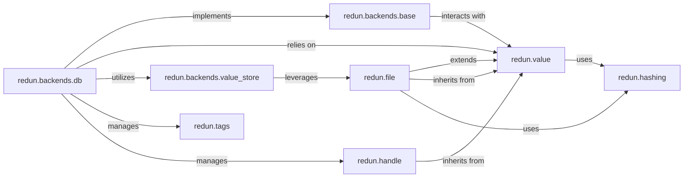

## Details

This component is fundamental to Redun's reproducibility, caching mechanisms, and historical analysis capabilities by managing the persistence, serialization, hashing, and retrieval of all workflow metadata, task values, and files.

### redun.value

This is the foundational module defining the `Value` base class, from which nearly all Redun data types (including expressions, tasks, files, and handles) inherit. It provides core mechanisms for consistent serialization, deserialization, and hashing of Python objects. The `TypeRegistry` within this module is crucial for managing how different data types are handled for persistence and caching.

**Related Classes/Methods**:

- <a href="https://github.com/insitro/redun/redun/value.py#L1-L1" target="_blank" rel="noopener noreferrer">`redun.value` (1:1)</a>

### redun.file

This module extends the `redun.value` abstraction to specifically handle file and directory objects. It provides a unified interface for interacting with various file systems (e.g., local, S3, Azure Blob, GCP Storage, HTTP, FTP), abstracting away the underlying storage details. It ensures that files are treated as first-class Redun values, allowing them to be hashed, cached, and tracked within workflows.

**Related Classes/Methods**:

- <a href="https://github.com/insitro/redun/redun/file.py#L1-L1" target="_blank" rel="noopener noreferrer">`redun.file` (1:1)</a>

### redun.hashing

This module provides the core logic for consistent hashing of Python objects and data structures. It is a cornerstone of Redun's caching mechanisms and reproducibility, ensuring that identical inputs always produce identical hashes, allowing for efficient cache lookups and verification of computational integrity.

**Related Classes/Methods**:

- <a href="https://github.com/insitro/redun/redun/hashing.py#L1-L1" target="_blank" rel="noopener noreferrer">`redun.hashing` (1:1)</a>

### redun.backends.base

This module defines the abstract base classes and interfaces for Redun backends. It establishes the contract that any concrete backend implementation must adhere to for persisting and retrieving workflow metadata, job status, and cached results. It ensures a consistent API for different storage solutions.

**Related Classes/Methods**:

- <a href="https://github.com/insitro/redun/redun/backends/base.py#L1-L1" target="_blank" rel="noopener noreferrer">`redun.backends.base` (1:1)</a>

### redun.backends.db

This is a concrete implementation of `redun.backends.base`, providing a robust database-backed persistence layer for Redun. It handles the storage and retrieval of detailed workflow metadata, including executions, jobs, call nodes, values, and tags. It leverages internal serializers (`redun.backends.db.serializers`) to manage the structured storage of these entities.

**Related Classes/Methods**:

- `redun.backends.db` (1:1)

### redun.backends.value_store

This component, often used in conjunction with `redun.backends.db`, is responsible for the efficient storage and retrieval of the actual content of large values (e.g., task outputs, intermediate data). It likely leverages file system abstractions provided by `redun.file` for its operations, separating large data storage from metadata.

**Related Classes/Methods**:

- <a href="https://github.com/insitro/redun/redun/backends/value_store.py#L1-L1" target="_blank" rel="noopener noreferrer">`redun.backends.value_store` (1:1)</a>

### redun.tags

This module provides a mechanism for associating arbitrary key-value metadata (tags) with workflow entities such as executions and jobs. These tags are persisted by the backend and can be used for organization, filtering, and querying historical workflow data, enhancing the "historical analysis capabilities."

**Related Classes/Methods**:

- <a href="https://github.com/insitro/redun/redun/tags.py#L1-L1" target="_blank" rel="noopener noreferrer">`redun.tags` (1:1)</a>

### redun.handle

This module introduces the concept of "handles," which are `Value` objects that represent deferred or indirect access to other values. Handles are particularly useful for managing large or external data, allowing Redun to avoid unnecessary data movement until the value is actually needed, optimizing data flow.

**Related Classes/Methods**:

- <a href="https://github.com/insitro/redun/redun/handle.py#L1-L1" target="_blank" rel="noopener noreferrer">`redun.handle` (1:1)</a>

### [FAQ](https://github.com/CodeBoarding/GeneratedOnBoardings/tree/main?tab=readme-ov-file#faq)