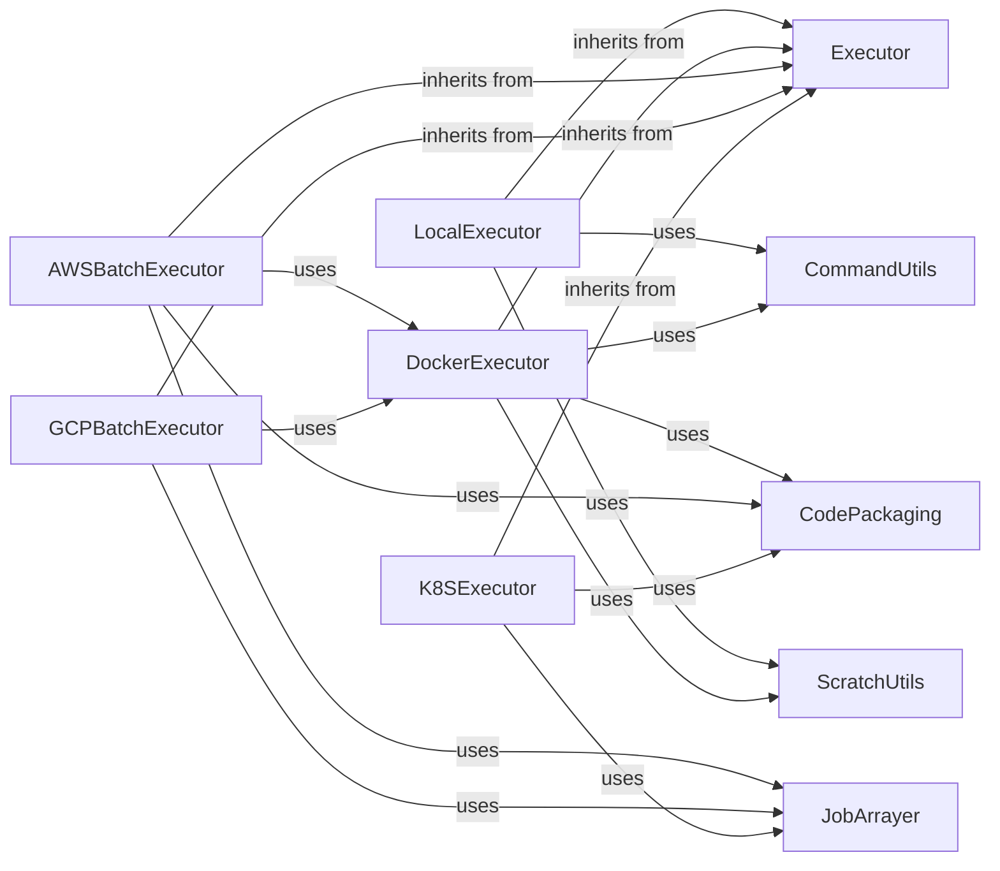

## Details

The `Execution Backends` subsystem in `redun` provides an extensible and unified interface for executing tasks across diverse computational environments. It abstracts the complexities of running tasks locally, within Docker containers, or on various cloud-specific services, ensuring a consistent workflow regardless of the underlying infrastructure.

### Executor

This is the abstract base class for all executors in `redun`. It defines the common interface and lifecycle methods (e.g., `submit`, `submit_script`, `start`, `stop`, `monitor`) that all concrete executors must implement or override. It provides a foundational structure for managing job submissions, monitoring, and result processing, ensuring consistency across different execution environments.

**Related Classes/Methods**:

- <a href="https://github.com/insitro/redun/redun/executors/base.py#L12-L73" target="_blank" rel="noopener noreferrer">`redun.executors.base.Executor` (12:73)</a>

### LocalExecutor

The simplest concrete implementation of `Executor`, designed for running tasks directly on the local machine where `redun` is invoked. It's primarily used for development, testing, and small-scale workflows, serving as the default execution backend.

**Related Classes/Methods**:

- <a href="https://github.com/insitro/redun/redun/executors/local.py#L64-L261" target="_blank" rel="noopener noreferrer">`redun.executors.local.LocalExecutor` (64:261)</a>

### DockerExecutor

An executor that runs tasks within Docker containers. It handles Docker image management and container execution, serving as a crucial component for isolated and reproducible task execution. It can also act as a base for other container-orchestrated executors.

**Related Classes/Methods**:

- <a href="https://github.com/insitro/redun/redun/executors/docker.py#L250-L478" target="_blank" rel="noopener noreferrer">`redun.executors.docker.DockerExecutor` (250:478)</a>

### AWSBatchExecutor

A concrete implementation of `Executor` that leverages AWS Batch for executing tasks. It handles the specifics of interacting with AWS Batch services, including creating and managing job definitions, submitting jobs, and monitoring their status, integrating with AWS ECR and S3.

**Related Classes/Methods**:

- <a href="https://github.com/insitro/redun/redun/executors/aws_batch.py#L832-L1490" target="_blank" rel="noopener noreferrer">`redun.executors.aws_batch.AWSBatchExecutor` (832:1490)</a>

### GCPBatchExecutor

Implements task execution on Google Cloud Platform's Batch service. Similar to `AWSBatchExecutor`, it manages GCP Batch jobs, handles resource allocation, and monitors job progress, often using `DockerExecutor` internally.

**Related Classes/Methods**:

- <a href="https://github.com/insitro/redun/redun/executors/gcp_batch.py#L47-L614" target="_blank" rel="noopener noreferrer">`redun.executors.gcp_batch.GCPBatchExecutor` (47:614)</a>

### K8SExecutor

This executor integrates with Kubernetes clusters to run tasks as Kubernetes Jobs. It manages Kubernetes resources (Jobs, Pods, Secrets) and handles the complexities of deploying and monitoring containerized tasks within a Kubernetes environment.

**Related Classes/Methods**:

- <a href="https://github.com/insitro/redun/redun/executors/k8s.py#L358-L1118" target="_blank" rel="noopener noreferrer">`redun.executors.k8s.K8SExecutor` (358:1118)</a>

### CommandUtils

A utility module for generating shell commands that execute `redun` tasks within the job environment. This is a fundamental component as all concrete executors rely on it to construct the actual commands that will be run.

**Related Classes/Methods**:

- <a href="https://github.com/insitro/redun/redun/executors/command.py#L0-L0" target="_blank" rel="noopener noreferrer">`redun.executors.command` (0:0)</a>

### CodePackaging

A utility module responsible for packaging the necessary `redun` code and user scripts into deployable artifacts (e.g., zip files, Docker images). This is crucial for remote executors to have access to the workflow code.

**Related Classes/Methods**:

- <a href="https://github.com/insitro/redun/redun/executors/code_packaging.py#L0-L0" target="_blank" rel="noopener noreferrer">`redun.executors.code_packaging` (0:0)</a>

### ScratchUtils

A utility module for managing temporary files, storing job results, and handling error logs in a designated scratch space accessible by the executors. It ensures proper handling of intermediate and output data.

**Related Classes/Methods**:

- <a href="https://github.com/insitro/redun/redun/executors/scratch.py#L0-L0" target="_blank" rel="noopener noreferrer">`redun.executors.scratch` (0:0)</a>

### JobArrayer

A utility for handling job arrays, allowing a single job submission to represent multiple, similar tasks. This is particularly useful for optimizing and scaling batch processing on cloud platforms by reducing overhead.

**Related Classes/Methods**:

- <a href="https://github.com/insitro/redun/redun/job_array.py#L0-L0" target="_blank" rel="noopener noreferrer">`redun.job_array` (0:0)</a>

### [FAQ](https://github.com/CodeBoarding/GeneratedOnBoardings/tree/main?tab=readme-ov-file#faq)