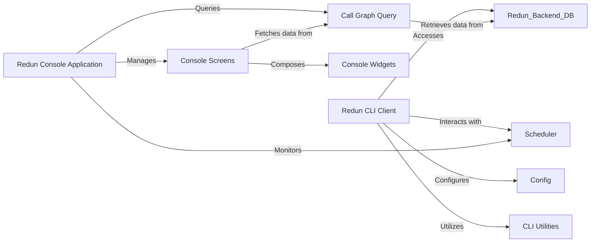

## Details

These components are fundamental because they directly implement the user-facing aspects of Redun, providing the means for users to interact with and monitor their workflows.

*   **Redun CLI Client** and **CLI Utilities**: These form the backbone of the command-line interface, which is the primary way users initiate and manage Redun workflows. They are essential for direct, scriptable interaction with the Redun system.

*   **Redun Console Application**, **Console Screens**, and **Console Widgets**: These three components collectively provide the interactive, real-time monitoring and inspection capabilities of Redun's Text-based User Interface (TUI). The `Redun Console Application` orchestrates the TUI, `Console Screens` define the distinct views for different types of workflow data, and `Console Widgets` are the reusable building blocks that compose these screens. This TUI is crucial for understanding complex workflow executions and debugging.

*   **Call Graph Query**: This component acts as the essential data access layer for the TUI. It abstracts the underlying database structure and provides a structured way for the console to retrieve and display relevant workflow information, making the interactive experience possible.

These components are distinct in their responsibilities (CLI vs. TUI, UI structure vs. data access) but work together to provide a comprehensive user interface for Redun. The `Scheduler` and `Redun Backend DB` are considered external dependencies that the User Interface interacts with, rather than being part of the User Interface subsystem itself.

### Redun CLI Client

The primary command-line interface (CLI) client for Redun, implemented by `redun.cli.RedunClient`. It serves as the main entry point for users to execute various Redun commands, such as running tasks, managing configurations, and interacting with the backend.

**Related Classes/Methods**:

- <a href="https://github.com/insitro/redun/redun/cli.py#L864-L3192" target="_blank" rel="noopener noreferrer">`redun.cli.RedunClient` (864:3192)</a>

### CLI Utilities

A collection of helper functions and classes within the `redun.cli` module that support the `Redun CLI Client`. These utilities handle common CLI-related tasks like argument parsing, configuration management, version checking, and output formatting.

**Related Classes/Methods**:

- <a href="https://github.com/insitro/redun/redun/cli.py#L1-L1" target="_blank" rel="noopener noreferrer">`redun.cli` (1:1)</a>

### Redun Console Application

The main application class for the interactive Redun console (TUI), implemented by `redun.console.app.RedunApp`. It manages the overall console's lifecycle, handles screen navigation, and serves as the central hub for the graphical user interface.

**Related Classes/Methods**:

- <a href="https://github.com/insitro/redun/redun/console/app.py#L69-L239" target="_blank" rel="noopener noreferrer">`redun.console.app.RedunApp` (69:239)</a>

### Console Screens

A set of classes, inheriting from `redun.console.screens.RedunScreen`, that define the various interactive views within the Redun console (e.g., `ExecutionScreen`, `SearchScreen`, `ReplScreen`). Each screen is responsible for displaying specific types of workflow data, handling user input, and managing its own state.

**Related Classes/Methods**:

- <a href="https://github.com/insitro/redun/redun/console/screens.py#L57-L133" target="_blank" rel="noopener noreferrer">`redun.console.screens.RedunScreen` (57:133)</a>

- <a href="https://github.com/insitro/redun/redun/console/screens.py#L1-L1" target="_blank" rel="noopener noreferrer">`redun.console.screens` (1:1)</a>

- <a href="https://github.com/insitro/redun/redun/console/upstream_screen.py#L1-L1" target="_blank" rel="noopener noreferrer">`redun.console.upstream_screen` (1:1)</a>

### Console Widgets

Reusable UI components (e.g., `Table`, `CommandInput`, `ExecutionList`, `JobList`, `RedunHeader`) defined in `redun.console.widgets`. These modular elements are used by Console Screens to display data, receive input, and enhance the user experience within the TUI.

**Related Classes/Methods**:

- <a href="https://github.com/insitro/redun/redun/console/widgets.py#L1-L1" target="_blank" rel="noopener noreferrer">`redun.console.widgets` (1:1)</a>

### Call Graph Query

A component, primarily `redun.backends.db.query.CallGraphQuery`, responsible for querying and retrieving structured workflow data (e.g., executions, jobs, tasks, values) from the Redun backend database. It provides the necessary data for the interactive console screens.

**Related Classes/Methods**:

- <a href="https://github.com/insitro/redun/redun/backends/db/query.py#L148-L777" target="_blank" rel="noopener noreferrer">`redun.backends.db.query.CallGraphQuery` (148:777)</a>

### [FAQ](https://github.com/CodeBoarding/GeneratedOnBoardings/tree/main?tab=readme-ov-file#faq)