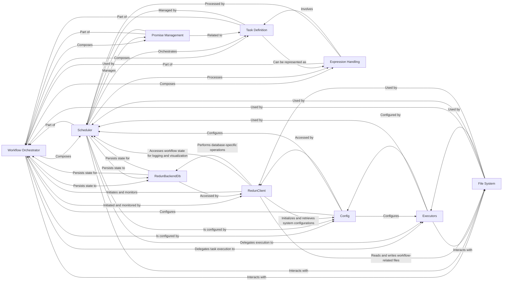

## Details

Detailed analysis of the Redun workflow orchestration system, outlining its key components and their interdependencies.

### Workflow Orchestrator [[Expand]](./Workflow_Orchestrator.md)

The core intelligence of Redun, responsible for defining, scheduling, and managing the execution of tasks within a computational graph. It handles dependency resolution, caching logic, and asynchronous operations, acting as the central coordinator for workflow execution. This component is fundamentally composed of the Scheduler, Task Definition, Expression Handling, and Promise Management components.

**Related Classes/Methods**:

- <a href="https://github.com/insitro/redun/redun/scheduler.py#L881-L2298" target="_blank" rel="noopener noreferrer">`redun.scheduler.Scheduler` (881:2298)</a>

- <a href="https://github.com/insitro/redun/redun/task.py#L141-L564" target="_blank" rel="noopener noreferrer">`redun.task.Task` (141:564)</a>

- <a href="https://github.com/insitro/redun/redun/expression.py#L38-L111" target="_blank" rel="noopener noreferrer">`redun.expression.Expression` (38:111)</a>

- <a href="https://github.com/insitro/redun/redun/promise.py#L6-L187" target="_blank" rel="noopener noreferrer">`redun.promise.Promise` (6:187)</a>

### Scheduler

The core engine within the Workflow Orchestrator, specifically responsible for managing the execution of tasks, tracking job states, resolving dependencies, and interacting with various executors. It maintains the overall state of active and historical workflows.

**Related Classes/Methods**:

- <a href="https://github.com/insitro/redun/redun/scheduler.py#L881-L2298" target="_blank" rel="noopener noreferrer">`redun.scheduler.Scheduler` (881:2298)</a>

### Task Definition

Defines the atomic units of work within a Redun workflow. Tasks encapsulate Python functions and their associated metadata, allowing them to be tracked, cached, and executed within the computational graph.

**Related Classes/Methods**:

- <a href="https://github.com/insitro/redun/redun/task.py#L141-L564" target="_blank" rel="noopener noreferrer">`redun.task.Task` (141:564)</a>

### Expression Handling

Manages the representation and evaluation of the computational graph. Expressions define how tasks and values are combined and depend on each other, forming the basis for dependency resolution and execution planning.

**Related Classes/Methods**:

- <a href="https://github.com/insitro/redun/redun/expression.py#L38-L111" target="_blank" rel="noopener noreferrer">`redun.expression.Expression` (38:111)</a>

### Promise Management

Provides a mechanism for handling asynchronous results and deferred computations within the workflow. Promises allow the scheduler to manage dependencies efficiently, enabling parallel execution and proper sequencing of tasks.

**Related Classes/Methods**:

- <a href="https://github.com/insitro/redun/redun/promise.py#L6-L187" target="_blank" rel="noopener noreferrer">`redun.promise.Promise` (6:187)</a>

### RedunBackendDb

The database backend component responsible for persisting Redun's workflow metadata, task results, execution logs, and other internal states. It provides an interface for storing and retrieving this critical information.

**Related Classes/Methods**:

- `redun.backends.db.RedunBackendDb` (1:1)

### Executors

A set of components responsible for executing Redun tasks in various environments (e.g., local, AWS Batch, Docker, Kubernetes). Each executor provides an interface for running tasks and managing their lifecycle within its specific execution context.

**Related Classes/Methods**:

- <a href="https://github.com/insitro/redun/redun/executors/base.py#L12-L73" target="_blank" rel="noopener noreferrer">`redun.executors.base.Executor` (12:73)</a>

### Config

Manages the configuration settings for the entire Redun system. This includes database connection details, executor configurations, and other global parameters that influence Redun's behavior.

**Related Classes/Methods**:

- <a href="https://github.com/insitro/redun/redun/config.py#L38-L150" target="_blank" rel="noopener noreferrer">`redun.config.Config` (38:150)</a>

### File System

An abstraction layer for handling file operations across different storage systems (e.g., local disk, AWS S3, Google Cloud Storage, Azure Blob Storage). It ensures that Redun can seamlessly interact with various data sources and sinks.

**Related Classes/Methods**:

- <a href="https://github.com/insitro/redun/redun/file.py#L210-L397" target="_blank" rel="noopener noreferrer">`redun.file.FileSystem` (210:397)</a>

### RedunClient

The primary command-line interface (CLI) client for Redun. It acts as the main entry point for users to execute various Redun commands, such as running tasks, managing configurations, inspecting workflow history, and interacting with the backend.

**Related Classes/Methods**:

- <a href="https://github.com/insitro/redun/redun/cli.py#L864-L3192" target="_blank" rel="noopener noreferrer">`redun.cli.RedunClient` (864:3192)</a>

### [FAQ](https://github.com/CodeBoarding/GeneratedOnBoardings/tree/main?tab=readme-ov-file#faq)