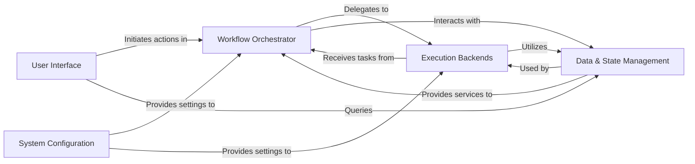

## Details

Final Architecture Overview for `redun`

### Workflow Orchestrator [[Expand]](./Workflow_Orchestrator.md)

The core intelligence of Redun, responsible for defining, scheduling, and managing the execution of tasks within a computational graph. It handles dependency resolution, caching logic, and asynchronous operations, acting as the central coordinator for workflow execution.

**Related Classes/Methods**:

- <a href="https://github.com/insitro/redun/redun/scheduler.py#L1-L1" target="_blank" rel="noopener noreferrer">`redun.scheduler` (1:1)</a>

- <a href="https://github.com/insitro/redun/redun/task.py#L718-L720" target="_blank" rel="noopener noreferrer">`redun.task` (718:720)</a>

- <a href="https://github.com/insitro/redun/redun/expression.py#L1-L1" target="_blank" rel="noopener noreferrer">`redun.expression` (1:1)</a>

- <a href="https://github.com/insitro/redun/redun/promise.py#L1-L1" target="_blank" rel="noopener noreferrer">`redun.promise` (1:1)</a>

### Data & State Management [[Expand]](./Data_State_Management.md)

Manages the persistence, serialization, hashing, and retrieval of all workflow metadata, task values, and files. This component is fundamental to Redun's reproducibility, caching mechanisms, and historical analysis capabilities.

**Related Classes/Methods**:

- `redun.backends.db` (1:1)

- <a href="https://github.com/insitro/redun/redun/value.py#L1-L1" target="_blank" rel="noopener noreferrer">`redun.value` (1:1)</a>

- <a href="https://github.com/insitro/redun/redun/file.py#L1-L1" target="_blank" rel="noopener noreferrer">`redun.file` (1:1)</a>

- <a href="https://github.com/insitro/redun/redun/hashing.py#L1-L1" target="_blank" rel="noopener noreferrer">`redun.hashing` (1:1)</a>

- <a href="https://github.com/insitro/redun/redun/tags.py#L1-L1" target="_blank" rel="noopener noreferrer">`redun.tags` (1:1)</a>

### Execution Backends [[Expand]](./Execution_Backends.md)

An extensible layer that abstracts the execution of tasks across various computational environments. It provides a unified interface for running tasks locally, in Docker containers, or on cloud-specific services like AWS Batch, GCP Batch, or Kubernetes.

**Related Classes/Methods**:

- <a href="https://github.com/insitro/redun/redun/executors/base.py#L1-L1" target="_blank" rel="noopener noreferrer">`redun.executors.base` (1:1)</a>

- <a href="https://github.com/insitro/redun/redun/executors/local.py#L1-L1" target="_blank" rel="noopener noreferrer">`redun.executors.local` (1:1)</a>

- <a href="https://github.com/insitro/redun/redun/executors/docker.py#L1-L1" target="_blank" rel="noopener noreferrer">`redun.executors.docker` (1:1)</a>

- <a href="https://github.com/insitro/redun/redun/executors/aws_batch.py#L1-L1" target="_blank" rel="noopener noreferrer">`redun.executors.aws_batch` (1:1)</a>

- <a href="https://github.com/insitro/redun/redun/executors/aws_glue.py#L1-L1" target="_blank" rel="noopener noreferrer">`redun.executors.aws_glue` (1:1)</a>

- <a href="https://github.com/insitro/redun/redun/executors/gcp_batch.py#L1-L1" target="_blank" rel="noopener noreferrer">`redun.executors.gcp_batch` (1:1)</a>

- <a href="https://github.com/insitro/redun/redun/executors/k8s.py#L1-L1" target="_blank" rel="noopener noreferrer">`redun.executors.k8s` (1:1)</a>

### User Interface [[Expand]](./User_Interface.md)

Provides the primary means for users to interact with Redun. This includes the command-line interface (CLI) for initiating and managing workflows, and an interactive console (TUI) for monitoring and inspecting execution history.

**Related Classes/Methods**:

- <a href="https://github.com/insitro/redun/redun/cli.py#L1-L1" target="_blank" rel="noopener noreferrer">`redun.cli` (1:1)</a>

- <a href="https://github.com/insitro/redun/redun/console/app.py#L1-L1" target="_blank" rel="noopener noreferrer">`redun.console.app` (1:1)</a>

- <a href="https://github.com/insitro/redun/redun/console/screens.py#L1-L1" target="_blank" rel="noopener noreferrer">`redun.console.screens` (1:1)</a>

- <a href="https://github.com/insitro/redun/redun/console/widgets.py#L1-L1" target="_blank" rel="noopener noreferrer">`redun.console.widgets` (1:1)</a>

### System Configuration

Centralized management of Redun's operational settings. It allows users to customize various aspects of the system, including executor parameters, database connections, and default behaviors, ensuring flexible deployment and operation.

**Related Classes/Methods**:

- <a href="https://github.com/insitro/redun/redun/config.py#L1-L1" target="_blank" rel="noopener noreferrer">`redun.config` (1:1)</a>

### [FAQ](https://github.com/CodeBoarding/GeneratedOnBoardings/tree/main?tab=readme-ov-file#faq)