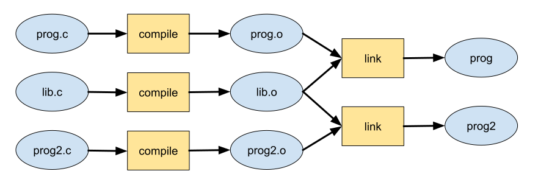
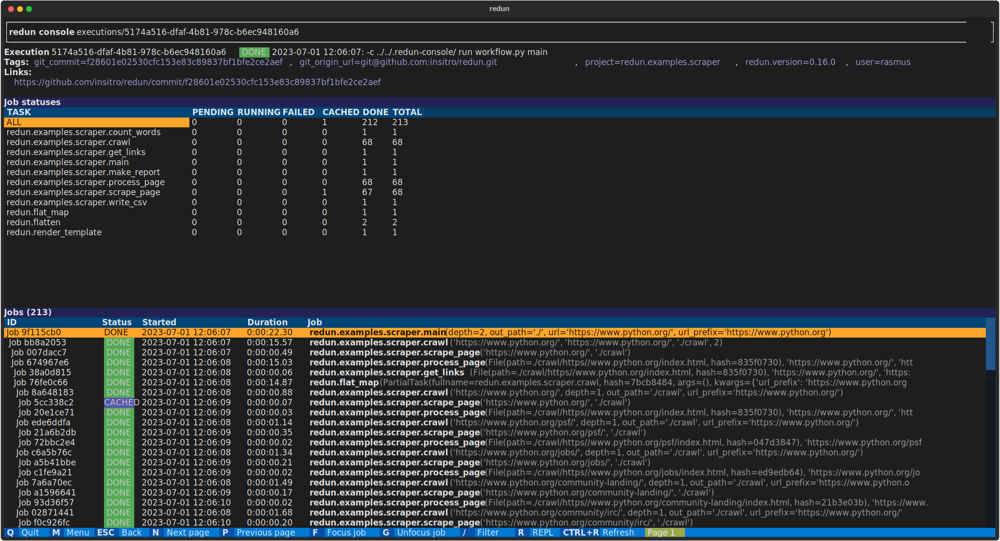
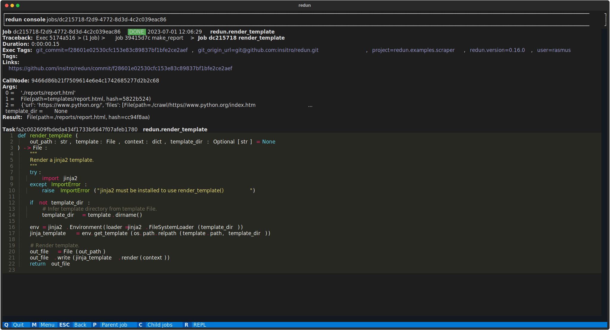
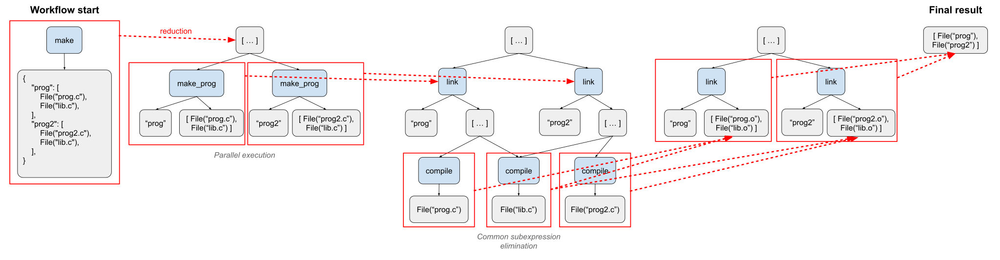

*yet another redundant workflow engine*

**redun** aims to be a more expressive and efficient workflow framework, built on top of the popular Python programming language. It takes the somewhat contrarian view that writing dataflows directly is unnecessarily restrictive, and by doing so we lose abstractions we have come to rely on in most modern high-level languages (control flow, composability, recursion, high order functions, etc). redun's key insight is that workflows can be expressed as [lazy expressions](#whats-the-trick), which are then evaluated by a scheduler that performs automatic parallelization, caching, and data provenance logging.

redun's key features are:

- Workflows are defined by lazy expressions that when evaluated emit dynamic directed acyclic graphs (DAGs), enabling complex data flows.
- Incremental computation that is reactive to both data changes as well as code changes.
- Workflow tasks can be executed on a variety of compute backend (threads, processes, AWS batch jobs, Spark jobs, etc). 
- Data changes are detected for in-memory values as well as external data sources such as files and object stores using file hashing.
- Code changes are detected by hashing individual Python functions and comparing them against historical call graph recordings.
- Past intermediate results are cached centrally and reused across workflows.
- Past call graphs can be used as a data lineage record and can be queried for debugging and auditing.

To learn more, see our [Medium](https://insitro.medium.com/when-data-science-goes-with-the-flow-insitro-introduces-redun-8b06b707a14b) and [AWS HPC](https://aws.amazon.com/blogs/hpc/data-science-workflows-at-insitro-using-redun-on-aws-batch/) blog posts, as well as our [documentation](https://insitro.github.io/redun/design.html), [tutorial](examples/README.md), and [influences](https://insitro.github.io/redun/design.html#influences).

*About the name:* The name "redun" is self-deprecating (there are [A LOT](https://github.com/pditommaso/awesome-pipeline) of workflow engines), but it is also a reference to its original inspiration, the [redo](https://apenwarr.ca/log/20101214) build system.

## Install

```sh
pip install redun
```

See [developing](https://insitro.github.io/redun/developing.html) for more information on working with the code.

### Postgres backend

To use postgres as a recording backend, use

```sh
pip install redun[postgres]
```

The above assumes the following dependencies are installed:
* `pg_config` (in the `postgresql-devel` package; on ubuntu: `apt-get install libpq-dev`)
* `gcc` (on ubuntu or similar `sudo apt-get install gcc`)

### Optional Visualization

To generate graphviz images and dot files, use

```sh
pip install redun[viz]
```

The above assumes the following dependencies are installed:
* `graphviz` (on ubuntu: `apt-get install graphviz graphviz-dev`, via homebrew: `brew install graphviz`)
* `gcc` (on ubuntu or similar `sudo apt-get install gcc`)

## Use cases

redun's general approach to defining workflows makes it a good choice for implementing workflows for a wide-variety of use cases:

- [Bioinformatics](examples/06_bioinfo_batch/)
- [Cheminformatics](examples/aws_glue/rdkit_workflow.py)
- [Web or API data extraction](examples/scraping/)
- [General data science](examples/word_count/)
- [And much more](examples/)

## Small taste

Here is a quick example of using redun for a familiar workflow, compiling a C program ([full example](examples/02_compile/README.md)). In general, any kind of data processing could be done within each task (e.g. reading and writing CSVs, DataFrames, databases, APIs).

```py
# make.py

import os
from typing import Dict, List

from redun import task, File


redun_namespace = "redun.examples.compile"


@task()
def compile(c_file: File) -> File:
    """
    Compile one C file into an object file.
    """
    os.system(f"gcc -c {c_file.path}")
    return File(c_file.path.replace(".c", ".o"))


@task()
def link(prog_path: str, o_files: List[File]) -> File:
    """
    Link several object files together into one program.
    """
    o_files=" ".join(o_file.path for o_file in o_files)
    os.system(f"gcc -o {prog_path} {o_files}")
    return File(prog_path)


@task()
def make_prog(prog_path: str, c_files: List[File]) -> File:
    """
    Compile one program from its source C files.
    """
    o_files = [
        compile(c_file)
        for c_file in c_files
    ]
    prog_file = link(prog_path, o_files)
    return prog_file


# Definition of programs and their source C files.
files = {
    "prog": [
        File("prog.c"),
        File("lib.c"),
    ],
    "prog2": [
        File("prog2.c"),
        File("lib.c"),
    ],
}


@task()
def make(files : Dict[str, List[File]] = files) -> List[File]:
    """
    Top-level task for compiling all the programs in the project.
    """
    progs = [
        make_prog(prog_path, c_files)
        for prog_path, c_files in files.items()
    ]
    return progs
```

Notice, that besides the `@task` decorator, the code follows typical Python conventions and is organized like a sequential program.

We can run the workflow using the `redun run` command:

```
redun run make.py make

[redun] redun :: version 0.4.15
[redun] config dir: /Users/rasmus/projects/redun/examples/compile/.redun
[redun] Upgrading db from version -1.0 to 2.0...
[redun] Start Execution 69c40fe5-c081-4ca6-b232-e56a0a679d42:  redun run make.py make
[redun] Run    Job 72bdb973:  redun.examples.compile.make(files={'prog': [File(path=prog.c, hash=dfa3aba7), File(path=lib.c, hash=a2e6cbd9)], 'prog2': [File(path=prog2.c, hash=c748e4c7), File(path=lib.c, hash=a2e6cbd9)]}) on default
[redun] Run    Job 096be12b:  redun.examples.compile.make_prog(prog_path='prog', c_files=[File(path=prog.c, hash=dfa3aba7), File(path=lib.c, hash=a2e6cbd9)]) on default
[redun] Run    Job 32ed5cf8:  redun.examples.compile.make_prog(prog_path='prog2', c_files=[File(path=prog2.c, hash=c748e4c7), File(path=lib.c, hash=a2e6cbd9)]) on default
[redun] Run    Job dfdd2ee2:  redun.examples.compile.compile(c_file=File(path=prog.c, hash=dfa3aba7)) on default
[redun] Run    Job 225f924d:  redun.examples.compile.compile(c_file=File(path=lib.c, hash=a2e6cbd9)) on default
[redun] Run    Job 3f9ea7ae:  redun.examples.compile.compile(c_file=File(path=prog2.c, hash=c748e4c7)) on default
[redun] Run    Job a8b21ec0:  redun.examples.compile.link(prog_path='prog', o_files=[File(path=prog.o, hash=4934098e), File(path=lib.o, hash=7caa7f9c)]) on default
[redun] Run    Job 5707a358:  redun.examples.compile.link(prog_path='prog2', o_files=[File(path=prog2.o, hash=cd0b6b7e), File(path=lib.o, hash=7caa7f9c)]) on default
[redun]
[redun] | JOB STATUS 2021/06/18 10:34:29
[redun] | TASK                             PENDING RUNNING  FAILED  CACHED    DONE   TOTAL
[redun] |
[redun] | ALL                                    0       0       0       0       8       8
[redun] | redun.examples.compile.compile         0       0       0       0       3       3
[redun] | redun.examples.compile.link            0       0       0       0       2       2
[redun] | redun.examples.compile.make            0       0       0       0       1       1
[redun] | redun.examples.compile.make_prog       0       0       0       0       2       2
[redun]
[File(path=prog, hash=a8d14a5e), File(path=prog2, hash=04bfff2f)]
```

This should have taken three C source files (`lib.c`, `prog.c`, and `prog2.c`), compiled them to three object files (`lib.o`, `prog.o`, `prog2.o`), and then linked them into two binaries (`prog` and `prog2`). Specifically, redun automatically determined the following dataflow DAG and performed the compiling and linking steps in separate threads:

<p align="center">
  
</p>

Using the `redun log` command, we can see the full job tree of the most recent execution (denoted `-`):

```
redun log -

Exec 69c40fe5-c081-4ca6-b232-e56a0a679d42 [ DONE ] 2021-06-18 10:34:28:  run make.py make
Duration: 0:00:01.47

Jobs: 8 (DONE: 8, CACHED: 0, FAILED: 0)
--------------------------------------------------------------------------------
Job 72bdb973 [ DONE ] 2021-06-18 10:34:28:  redun.examples.compile.make(files={'prog': [File(path=prog.c, hash=dfa3aba7), File(path=lib.c, hash=a2e6cbd9)], 'prog2': [File(path=prog2.c, hash=c748e4c7), Fil
  Job 096be12b [ DONE ] 2021-06-18 10:34:28:  redun.examples.compile.make_prog('prog', [File(path=prog.c, hash=dfa3aba7), File(path=lib.c, hash=a2e6cbd9)])
    Job dfdd2ee2 [ DONE ] 2021-06-18 10:34:28:  redun.examples.compile.compile(File(path=prog.c, hash=dfa3aba7))
    Job 225f924d [ DONE ] 2021-06-18 10:34:28:  redun.examples.compile.compile(File(path=lib.c, hash=a2e6cbd9))
    Job a8b21ec0 [ DONE ] 2021-06-18 10:34:28:  redun.examples.compile.link('prog', [File(path=prog.o, hash=4934098e), File(path=lib.o, hash=7caa7f9c)])
  Job 32ed5cf8 [ DONE ] 2021-06-18 10:34:28:  redun.examples.compile.make_prog('prog2', [File(path=prog2.c, hash=c748e4c7), File(path=lib.c, hash=a2e6cbd9)])
    Job 3f9ea7ae [ DONE ] 2021-06-18 10:34:28:  redun.examples.compile.compile(File(path=prog2.c, hash=c748e4c7))
    Job 5707a358 [ DONE ] 2021-06-18 10:34:29:  redun.examples.compile.link('prog2', [File(path=prog2.o, hash=cd0b6b7e), File(path=lib.o, hash=7caa7f9c)])
```

Notice, redun automatically detected that `lib.c` only needed to be compiled once and that its result can be reused (a form of [common subexpression elimination](https://en.wikipedia.org/wiki/Common_subexpression_elimination)).

Using the `--file` option, we can see all files (or URLs) that were read, `r`, or written, `w`, by the workflow:

```
redun log --file

File 2b6a7ce0 2021-06-18 11:41:42 r  lib.c
File d90885ad 2021-06-18 11:41:42 rw lib.o
File 2f43c23c 2021-06-18 11:41:42 w  prog
File dfa3aba7 2021-06-18 10:34:28 r  prog.c
File 4934098e 2021-06-18 10:34:28 rw prog.o
File b4537ad7 2021-06-18 11:41:42 w  prog2
File c748e4c7 2021-06-18 10:34:28 r  prog2.c
File cd0b6b7e 2021-06-18 10:34:28 rw prog2.o
```

We can also look at the provenance of a single file, such as the binary `prog`:

```
redun log prog

File 2f43c23c 2021-06-18 11:41:42 w  prog
Produced by Job a8b21ec0

  Job a8b21ec0-e60b-4486-bcf4-4422be265608 [ DONE ] 2021-06-18 11:41:42:  redun.examples.compile.link('prog', [File(path=prog.o, hash=4934098e), File(path=lib.o, hash=d90885ad)])
  Traceback: Exec 4a2b624d > (1 Job) > Job 2f8b4b5f make_prog > Job a8b21ec0 link
  Duration: 0:00:00.24

    CallNode 6c56c8d472dc1d07cfd2634893043130b401dc84 redun.examples.compile.link
      Args:   'prog', [File(path=prog.o, hash=4934098e), File(path=lib.o, hash=d90885ad)]
      Result: File(path=prog, hash=2f43c23c)

    Task a20ef6dc2ab4ed89869514707f94fe18c15f8f66 redun.examples.compile.link

      def link(prog_path: str, o_files: List[File]) -> File:
          """
          Link several object files together into one program.
          """
          o_files=" ".join(o_file.path for o_file in o_files)
          os.system(f"gcc -o {prog_path} {o_files}")
          return File(prog_path)


    Upstream dataflow:

      result = File(path=prog, hash=2f43c23c)

      result <-- <6c56c8d4> link(prog_path, o_files)
        prog_path = <ee510692> 'prog'
        o_files   = <f1eaf150> [File(path=prog.o, hash=4934098e), File(path=lib.o, hash=d90885ad)]

      prog_path <-- argument of <a4ac4959> make_prog(prog_path, c_files)
                <-- origin

      o_files <-- derives from
        compile_result   = <d90885ad> File(path=lib.o, hash=d90885ad)
        compile_result_2 = <4934098e> File(path=prog.o, hash=4934098e)

      compile_result <-- <45054a8f> compile(c_file)
        c_file = <2b6a7ce0> File(path=lib.c, hash=2b6a7ce0)

      c_file <-- argument of <a4ac4959> make_prog(prog_path, c_files)
             <-- argument of <a9a6af53> make(files)
             <-- origin

      compile_result_2 <-- <8d85cebc> compile(c_file_2)
        c_file_2 = <dfa3aba7> File(path=prog.c, hash=dfa3aba7)

      c_file_2 <-- argument of <74cceb4e> make_prog(prog_path, c_files)
               <-- argument of <45400ab5> make(files)
               <-- origin
```

This output shows the original `link` task source code responsible for creating the program `prog`, as well as the full derivation, denoted "upstream dataflow". See the full example for a [deeper explanation](examples/02_compile#data-provenance-for-files) of this output. To understand more about the data structure that powers these kinds of queries, see [call graphs](https://insitro.github.io/redun/design.html#call-graphs).

We can change one of the input files, such as `lib.c`, and rerun the workflow. Due to redun's automatic incremental compute, only the minimal tasks are rerun:

```
redun run make.py make

[redun] redun :: version 0.4.15
[redun] config dir: /Users/rasmus/projects/redun/examples/compile/.redun
[redun] Start Execution 4a2b624d-b6c7-41cb-acca-ec440c2434db:  redun run make.py make
[redun] Run    Job 84d14769:  redun.examples.compile.make(files={'prog': [File(path=prog.c, hash=dfa3aba7), File(path=lib.c, hash=2b6a7ce0)], 'prog2': [File(path=prog2.c, hash=c748e4c7), File(path=lib.c, hash=2b6a7ce0)]}) on default
[redun] Run    Job 2f8b4b5f:  redun.examples.compile.make_prog(prog_path='prog', c_files=[File(path=prog.c, hash=dfa3aba7), File(path=lib.c, hash=2b6a7ce0)]) on default
[redun] Run    Job 4ae4eaf6:  redun.examples.compile.make_prog(prog_path='prog2', c_files=[File(path=prog2.c, hash=c748e4c7), File(path=lib.c, hash=2b6a7ce0)]) on default
[redun] Cached Job 049a0006:  redun.examples.compile.compile(c_file=File(path=prog.c, hash=dfa3aba7)) (eval_hash=434cbbfe)
[redun] Run    Job 0f8df953:  redun.examples.compile.compile(c_file=File(path=lib.c, hash=2b6a7ce0)) on default
[redun] Cached Job 98d24081:  redun.examples.compile.compile(c_file=File(path=prog2.c, hash=c748e4c7)) (eval_hash=96ab0a2b)
[redun] Run    Job 8c95f048:  redun.examples.compile.link(prog_path='prog', o_files=[File(path=prog.o, hash=4934098e), File(path=lib.o, hash=d90885ad)]) on default
[redun] Run    Job 9006bd19:  redun.examples.compile.link(prog_path='prog2', o_files=[File(path=prog2.o, hash=cd0b6b7e), File(path=lib.o, hash=d90885ad)]) on default
[redun]
[redun] | JOB STATUS 2021/06/18 11:41:43
[redun] | TASK                             PENDING RUNNING  FAILED  CACHED    DONE   TOTAL
[redun] |
[redun] | ALL                                    0       0       0       2       6       8
[redun] | redun.examples.compile.compile         0       0       0       2       1       3
[redun] | redun.examples.compile.link            0       0       0       0       2       2
[redun] | redun.examples.compile.make            0       0       0       0       1       1
[redun] | redun.examples.compile.make_prog       0       0       0       0       2       2
[redun]
[File(path=prog, hash=2f43c23c), File(path=prog2, hash=b4537ad7)]
```

Notice, two of the compile jobs are cached (`prog.c` and `prog2.c`), but compiling the library `lib.c` and the downstream link steps are correctly rerun.

Check out the [examples](examples/) for more example workflows and features of redun. Also, see the [design notes](https://insitro.github.io/redun/design.html) for more information on redun's design.

## Data provenance exploration

All workflow executions are recorded into a database that can be explored using the [Console (TUI)](https://insitro.github.io/redun/design.html#call-graphs). The Console is convenient for debugging large complex workflows, as well as understanding how to reproduce and extend past work.

<a href="docs/source/_static/console-execution.svg"> <a href="docs/source/_static/console-job.svg">

## Mixed compute backends

In the above example, each task ran in its own thread. However, more generally each task can run in its own process, Docker container, [AWS Batch job](examples/05_aws_batch), or [Spark job](examples/aws_glue). With [minimal configuration](examples/05_aws_batch/.redun/redun.ini), users can lightly annotate where they would like each task to run. redun will automatically handle the data and code movement as well as backend scheduling:

```py
@task(executor="process")
def a_process_task(a):
    # This task runs in its own process.
    b = a_batch_task(a)
    c = a_spark_task(b)
    return c

@task(executor="batch", memory=4, vcpus=5)
def a_batch_task(a):
    # This task runs in its own AWS Batch job.
    # ...

@task(executor="spark")
def a_spark_task(b):
    # This task runs in its own Spark job.
    sc = get_spark_context()
    # ...
```

See the [executor documentation](https://insitro.github.io/redun/executors.html) for more.

## What's the trick?

How did redun automatically perform parallel compute, caching, and data provenance in the example above? The trick is that redun builds up an [expression graph](https://en.wikipedia.org/wiki/Abstract_semantic_graph) representing the workflow and evaluates the expressions using [graph reduction](https://en.wikipedia.org/wiki/Graph_reduction). For example, the workflow above went through the following evaluation process:



For a more in-depth walk-through, see the [scheduler tutorial](examples/03_scheduler).

## Why not another workflow engine?

redun focuses on making multi-domain scientific pipelines easy to develop and deploy. The automatic parallelism, caching, code, and data reactivity, as well as data provenance features, make it a great fit for such work. However, redun does not attempt to solve all possible workflow problems, so it's perfectly reasonable to supplement it with other tools. For example, while redun provides a very expressive way to define [task parallelism](https://en.wikipedia.org/wiki/Task_parallelism), it does not attempt to perform the kind of fine-grain [data parallelism](https://en.wikipedia.org/wiki/Data_parallelism) more commonly provided by Spark or Dask. Fortunately, redun does not perform any "dirty tricks" (e.g. complex static analysis or call stack manipulation), and so we have found it possible to safely combine redun with other frameworks (e.g. pyspark, pytorch, Dask, etc) to achieve the benefits of each tool.

Lastly, redun does not provide its own compute cluster but instead builds upon other systems that do, such as cloud provider services for batch Docker jobs or Spark jobs.

For more details on how redun compares to other related ideas, see the [influences](https://insitro.github.io/redun/design.html#influences) section.
