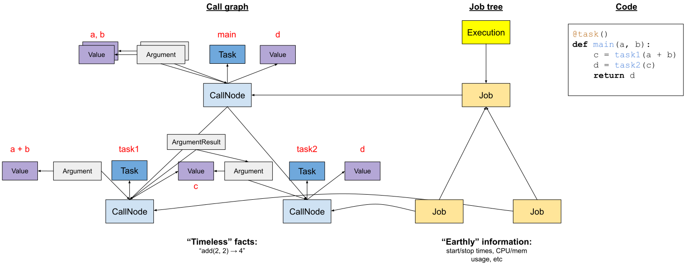

# Design overview

Here, we describe the high-level design features of redun.

## Motivation

The goal of redun is to provide the benefits of workflow engines for Python code in an easy and unintrusive way. Workflow engines can help run code faster by using parallel distributed execution, they can provide checkpointing for fast resuming of previously halted execution, they can reactively re-execute code based on changes in data or code, and can provide logging for data provenance.

While there are [A LOT](https://github.com/pditommaso/awesome-pipeline) of workflow engines available even for Python, redun differs by avoiding the need to restructure programs in terms of dataflow. In fact, we take the position that writing dataflows directly is unnecessarily restrictive, and by doing so we lose abstractions we have come to rely on in most modern high-level languages (control flow, recursion, higher order functions, etc). redun's key insight is that workflows can be expressed as lazy expressions, that are then evaluated by a scheduler that performs automatic parallelization, caching, and data provenance logging.

redun's key features are:

- Workflows are defined by lazy expressions that when evaluated emit dynamic directed acyclic graphs (DAGs), enabling complex data flows.
- Incremental computation that is reactive to both data changes as well as code changes.
- Workflow tasks can be executed on a variety of compute backend (threads, processes, AWS batch jobs, Spark jobs, etc). 
- Data changes are detected for in memory values as well as external data sources such as files and object stores using file hashing.
- Code changes are detected by hashing individual Python functions and comparing against historical call graph recordings.
- Past intermediate results are cached centrally and reused across workflows.
- Past call graphs can be used as a data lineage record and can be queried for debugging and auditing.

See the [influences](#influences) for more details on how these features relate to other tools.

## First example

redun augments Python to simulate a functional language with lazy evaluation. By writing code as pure functions without side-effects, redun can safely perform parallel execution and cache function results. By using [lazy evaluation](#lazy-evaluation-and-parallelism), we can execute a Python program quickly to automatically discover the dataflow between functions. Therefore, it is unnecessary to force the developer to specify the dataflow directly (e.g. Airflow's `set_upstream()` and `set_downstream()`).

redun does not try to impose a functional style on all code. Python supports multiple programming paradigms and a typical project might include libraries that make use of all of them. Therefore, redun allows the user to annotate which functions are effectively pure using a `@task` decorator. Such functions are called Tasks and they are the main unit of execution in redun. Tasks have several special properties that make them a powerful building block for data pipelines.

Here, is a small hello world program for redun:

```py
# hello_world.py
from redun import task, Scheduler

redun_namespace = "hello_world"

@task()
def get_planet():
    return "World"

@task()
def greeter(greet: str, thing: str):
    return "{}, {}!".format(greet, thing)

@task()
def main(greet: str="Hello"):
    return greeter(greet, get_planet())

if __name__ == "__main__":
    scheduler = Scheduler()
    result = scheduler.run(main())
    print(result)
```

It could be executed as a regular Python script:

```sh
python hello_world.py
# Which prints:
Hello, World!
```

Or it can be executed with the `redun` command-line program:

```sh 
redun run hello_world.py main
# Which prints:
'Hello, World!'
```

There is nothing special about the `main()` task, we could call any task from the command line:

```sh
redun run hello_world.py greeter --greet Hello --thing "Mars"
# Which prints:
'Hello, Mars!'
```

## Key features

### Memoization and reactivity

The return values of tasks are memoized. When calling the same task with the same arguments, a previously cached result is used instead of re-executing the task. This allows us to quickly resume a past execution, by fast forwarding through old parts of a program and only executing new parts.

Consider the example above, which is also available in `examples/hello_world.py`. On first execution, every task executes as indicated by the "[redun] Run" log lines:

```
redun run hello_world.py main

[redun] Check cache main (eval_hash=8cc26021)...
[redun] Run main(args=(), kwargs={'greet': 'Hello'}) on default
[redun] Check cache get_planet (eval_hash=e9a65320)...
[redun] Run get_planet(args=(), kwargs={}) on default
[redun] Check cache greeter (eval_hash=6447887f)...
[redun] Run greeter(args=('Hello', 'World'), kwargs={}) on default
'Hello, World!'
```

If we run a second time, all of the tasks will be cached (memoized) and will be fast-forwarded:

```
redun run hello_world.py main

[redun] Check cache main (eval_hash=8cc26021)...
[redun] Check cache get_planet (eval_hash=e9a65320)...
[redun] Check cache greeter (eval_hash=6447887f)...
'Hello, World!'
```

However, if we run with a new input argument, redun will detect that some tasks (`main`, `greeter`) do need to be re-executed:

```
redun run hello_world.py main --greet Hi

[redun] Check cache main (eval_hash=ff5c0bea)...
[redun] Run main(args=(), kwargs={'greet': 'Hi'}) on default
[redun] Check cache get_planet (eval_hash=e9a65320)...
[redun] Check cache greeter (eval_hash=ce5daced)...
[redun] Run greeter(args=('Hi', 'World'), kwargs={}) on default
'Hi, World!'
```

Also, notice that `get_planet()` did not need to be run again, because it arguments `()` are unchanged.

redun not only reacts to new input data changes, but it can also react to new *code changes*. Say we updated `get_planet()` to

```py
@task()
def get_planet():
    return 'Venus'
```

If we run redun again, redun will detect that `get_planet()` needs to run again because its code has changed:

```
redun run hello_world.py main

[redun] Check cache main (eval_hash=8cc26021)...
[redun] Check cache get_planet (eval_hash=f01c0932)...
[redun] Run get_planet(args=(), kwargs={}) on default
[redun] Check cache greeter (eval_hash=0e90d651)...
[redun] Run greeter(args=('Hello', 'Venus'), kwargs={}) on default
'Hello, Venus!'
```

How is this achieved? To make this memoization work, we need to know whether we have seen the same Task called with the same arguments. redun performs [hashing of Tasks](tasks.md#task-hashing) (see below) and arguments and uses those hashes as a cache key for fetching values from a result cache.


### Lazy evaluation and parallelism

Tasks are executed in a lazy and asynchronous manner. When a task is called, it returns immediately with an `Expression` object:

```py
from redun import task

@task()
def add(x, y=2):
    return x + y

result = add(10, y=3)
print(type(result))
# <class 'redun.expression.TaskExpression'>

print(result)
# add(10, y=3)
```

This expression means, "apply Task 'add' to arguments `10` and `y=3`". Expressions are evaluated to their concrete values by the redun scheduler:

```py
from redun import Scheduler

scheduler = Scheduler()
print(scheduler.run(add(10, y=3)))
# 13
```

To build up a larger program, these Expression objects can be used as arguments to other Tasks, such as:

```py
print(add(add(1, 2), add(3, 4)))
# add(add(1, 2), add(3, 4)) : type TaskExpresion
```

This gives us a tree of expressions, and more generally they can be Directed Acyclic Graphs (DAGs).

The redun scheduler analyzes these expression DAGs in order to determine in which order tasks need to be executed and which are safe to execute in parallel. For example, take the following program:

```py
# Assume step1, step2a, step2b are Tasks.
# Assume data is already defined.

result1 = step1(data)
result2a = step2a(result1, 10, 'red')
result2b = step2b(result1, True)
result3 = step3(result2a, result2b)
```

redun would execute all four lines immediately, deferring execution of the implementations of the steps (i.e., it doesn't call the body of the tasks), and builds up the following DAG of Tasks and Expressions:

```
data --> step1 --> result1 --> step2a --> result2a ---> step3 -- result3
                         \                          /
                          \--> step2b --> result2b /
```

redun will notice that `step2a` and `step2b` are safe to execute in parallel in separate threads (or processes, batch jobs, etc).

Every argument of a task can be a concrete value (e.g. `10`, `'red'`, `True`, a DataFrame, etc) or a lazy Expression of a value (e.g. `result1`). Just before a task executes, any arguments that were Expressions are resolved and replaced with concrete values. A task can also return an Expression received from subtasks as if it were a concrete value.

Working with lazy expressions requires some changes to how programs are structured. Briefly, once you have an Expression, the only way to "look inside" it, is to pass it to another task.

```py
@task()
def step1(x):
    return x + 1

@task()
def adder(values):
    # Arguments, such as `values` here, are always guaranteed to be concrete values.
    return sum(values)

@task()
def main():
    results = [step1(1), step1(2), step1(3)]
    # `results` is now a list of Expressions.
    # To add them together we need to pass them to another task.
    total = adder(result)
    return total
```

For those who are familiar with [Promises](https://en.wikipedia.org/wiki/Futures_and_promises) from other languages such as javascript, redun tasks perform the equivalent Promise manipulations:

```js
// This call
result2a = step2a(result1, 10, 'red')
// is equivalent to
result2a = result1.then(result1 => step2a(result1, 10, 'red'))
```

```js
// This call
result3 = step3(result2a, result2b)
// is equivalent to
result3 = Promise.all([result2a, result2b]).then(([result2a, result2b]) => step3(result2a, result2b))
```

Our use of Expressions to build up Task dependency is also similar to [Concurrent Futures in Python](https://docs.python.org/dev/library/concurrent.futures.html) and [Dask Delayed](https://docs.dask.org/en/latest/delayed.html).


### Tasks as pure functions

In order for redun to safely cache results and execute tasks in parallel, a few restrictions must be followed when writing a task. Primarily, tasks must be written such that they are "effectively [pure functions](https://en.wikipedia.org/wiki/Pure_function)". That is, given the same arguments, a task should always return (effectively) the same result. redun does not try to enforce strict purity, so minor side-effects such logging, or caching, are not an issue. A task can even be stochastic as long as the user is ok with using cached results from previous executions.

Tasks are allowed to call other tasks, just like one would write a function to call other functions. In fact, this is the encouraged way of building up a workflow program. Tasks are also allowed to call plain Python functions, as long as the net result of the task is effectively pure. You may also call tasks from plain Python functions as well. In fact, this often occurs when using functions such as `map()`.

```py
def small_helper(item):
    # Small plain Python code...
    return item2

@task()
def process_item(item):
    # Process an item...
    result = small_helper(item)
    return result

@task()
def process_items(items):
    return list(map(process_item, items))
```

One point of caution about using plain Python functions is that redun cannot hash the contents of a plain Python function, such as `small_helper` above. So changes to that function will not trigger re-execution. It becomes the responsibility of the user to force re-execution if needed, perhaps by bumping the version of the calling task or explicitly indicating the dependency to Redun (see [Task Hashing](tasks.md#task-hashing) for more).


### Result caching

As Redun's scheduler traverses the lazy expression graphs, it looks for opportunities to rely on cached values to avoid repeating computations it has already performed. Redun's approach to this is designed to be both efficient and correct. For more information on caching and scheduling, see (scheduler)[scheduler.md]. To illustrate how this works, and some of the subtleties therein, consider this example:

```py
@task(version='1')
def step1(x):
    return x + 1

@task(version='1')
def step2(x):
    return x * 2

@task(version='1')
def main(x):
    result1 = step1(x)
    result2 = step2(result1)
    return result2
```

When we execute `main(10)`, we get the result `(10 + 1) * 2 = 22`.

Now, say we updated `step1` to be:

```py
@task(version='2')
def step1(x):
    return x + 2
```

The correct answer to re-executing `main(10)` should be `((10 + 2) * 2) = 24`, however, overly simplistic result caching could miss the need to re-execute. After all, the code for `main` has not been changed (it's still version='1') and neither have its arguments, `10`. In order to handle such cases correctly, redun walks the expression graph, looking for caching opportunities at each step.

On the first execution of `scheduler.run(main(10))`:

- The scheduler considers `main(10)` as an Expression `TaskExpression('main', (10,), {})`.
- It first creates a cache key `(task=main, version='1', args=10)` and uses it to look up in a key-value store whether a previous result for this task call has been recorded. As this is our first execution, it will be a cache miss.
- The function `main(10)` is executed, and its initial result is an Expression tree: `TaskExpression('step2', (TaskExpression('step1', (10,) {}),), {})`.
- The *expression tree itself* is cached for the cache key `(task=main, version='1', args=10)`.
- The redun scheduler proceeds to evaluate the Expression tree, calling task `step1(10)` and then `step2(11)`.
- Each of their results is cached with cache keys indicating the task, task version/hash, and arguments.
- Ultimately the scheduler returns concrete value `22`.

For the second execution, with version='2' for step1, we have:

- The scheduler considers `main(10)` as an Expression `TaskExpression('main', (10,), {})`.
- It creates a cache key `(task=main, version='1', args=10)` and finds a cache hit, namely `TaskExpression('step2', (TaskExpression('step1', (10,) {}),), {})`.
- Due to having a cached result, the scheduler skips executing the function `main(10)`, and proceeds to evaluate the expression tree.
- When the scheduler evaluates `TaskExpression('step1', (10,) {}),)`, it notices that the cache key `(task=step1, version='2', args=10)` has not been seen before, and so it executes `step1(10)` to get the result `12`.
- The second sub-expression `TaskExpression('step2', (12,), {})` has also not been seen before, and so it executes as well.
- Ultimately the scheduler returns the concrete value `24`.

The end result of this process is that redun correctly skips re-execution of unchanged high level tasks, such as `main`, but properly re-executes updated deeply nested tasks, such as `step1`. It is quite common in large programs that the upper level tasks mostly perform routing of arguments and results, and the lower level tasks perform the actual work. Routing frequently is unaffected by the actual data or implementations of the lower level tasks, so being able to skip re-execution of high level tasks is an important optimization.


### File reactivity

A common use case for workflow engines is to read and write to files, either stored locally or remotely (object storage, S3, etc). Files can be a tricky data type to accommodate in a purely functional setting because the contents of files can change outside of our control. Ideally, we would like our workflow engine to react to those changes. For example, we would want to re-execute our workflow when:

- An input file changes its contents, and now we want to re-execute the tasks that read that input file so we can regenerate our downstream results.
- An output file has changed or been deleted, and now we want to re-execute the task that wrote that file so that we can reproduce the output file.

These behaviors are what we typically get from a workflow engine like `make`. Changing a C source code file gets detected by `make` and it recompiles the source file. Deleting the final compiled program, forces `make` to regenerate the program from earlier steps (source compiling, object linking, etc). In data science workflows, we would often like to re-execute a calculation when the input CSV changes, or if an output plot was deleted or altered.

redun achieves this behavior by wrapping file input/output (IO) in a special class called `redun.File`. Here, is an example usage:

```py
import csv

from redun import task, File

redun_namespace = "examples.files"

@task()
def process_data(input_file):
    with input_file.open() as infile:
        rows = list(csv.reader(infile))

    # result = calculation with rows...

    output_file = File('output.txt')
    with output.open('w') as out:
        out.write(result)
    return output_file

@task()
def main():
    input_file = File('input.csv')
    output_file = process_data(input_file)
    return output_file
```

The `File()` constructor takes a path as an argument (it can be a local file or any [fsspec](https://filesystem-spec.readthedocs.io/en/latest/) supported remote URL, such as S3 or GCP.) and provides familiar file IO methods such as `open()` and `close()`. `open()` gives a usual file stream that we can read or write from. The special logic happens when a File is returned from a task or passed as an argument. In those situations, the File is hashed and the File reference is recorded in the call graph. By default, redun performs a fast pseudo hashing of a file by hashing the triple (file path, byte size, modification time) (a technique used by other workflow engines, such as [Nextflow](https://www.nextflow.io/)).

When a change is made to the input file `input.csv`, redun will notice that the File's hash has changed and will consider it a new value that requires `process_data()` to re-execute. This is very similar to the caching logic for any other task argument.

However, if `output.txt` is deleted or altered, redun does something special. When redun retrieves from the call graph a previously cached `output_file` result, it compares the recorded hash with a new hash computed from the current file in the filesystem. If the hashes don't match, the cached File is considered *invalid*, and it is considered a cache miss. This will force `process_data()` to re-execute.

We call File an example of an *External Value*, because Files can change in an external system, such as a file system outside our control. Consequently, when we fetch a File from the cache, we must first check whether it's still valid (i.e. cached hash matches current hash from filesystem).

redun naturally understands which Files are used for input vs output based on whether they are passed as arguments or returned as results, respectively. Note, it can lead to confusing behavior to pass a File as input to a Task, alter it, and then return it as a result. That would lead to the recorded call node to be immediately out of date (its input File hash doesn't match anymore). The user should be careful to avoid this pattern.

See the [Validity](values.md#Validity) section below for additional discussion on the general feature.

### Shell scripting

It is common, especially in bioinformatics, to use workflow engines to combine together unix programs into a computational pipeline. Typically, each program exchanges data with each other through input and output files. redun provides several features to ease the calling of programs through scripts and managing their input and output files.

#### Script tasks

A *script task* is a special task in redun whose definition is a shell script as opposed to a python function. Script tasks are defined by passing the task option `script=True` in the `@task()` decorator and returning a string containing a shell script.

```py
@task(script=True)
def task1(arg1, arg2):
    return f"""
    mkdir dir
    cd dir
    my-prog {arg1} {arg2}
    """
```

The user can use even use f-string interpolation to conveniently pass task arguments (e.g. `arg1` and `arg2`) to the script.

The return value of a script task is the standard output of the script. Here, is an example of a normal task, `grep_files()` calling a script task `grep()`:

```py
@task(script=True)
def grep(pattern: str, file: File):
    # Calls grep to find pattern in a file.
    return f"""
    grep {pattern} {file.path}
    """

@task()
def grep_files(pattern: str, files: List[File]) -> List[str]:
    # Calls grep to find a pattern on a list of files.
    matches = [
        grep(pattern, file)  # Result is stdout of `grep {pattern} {file.path}`
        for file in files
    ]
    return matches
```

Scripts are assumed to be `sh` scripts by default, but custom interpreters (e.g. `python`) can be specified using `#!` in the first line.

```py
@task(script=True)
def grep(pattern: str, file: File):
    # Calls grep to find pattern in a file.
    return f"""
    #!/usr/bin/python
    print('Hello, World!')
    """
```

Feel free to indent lines to match the surrounding code. redun uses [dedent()](https://docs.python.org/3/library/textwrap.html#textwrap.dedent) to remove leading whitespace in scripts.


#### File staging

When defining script tasks that run on a remote execution environment (e.g. AWS Batch), it is common to have to copy input files from a cloud storage location (e.g. S3) to the compute node and similarly copy output files from the compute node back to cloud storage. We call this file staging and unstaging, respectively.

Manually performing file staging would look something like this:

```py
@task(script=True)
def align_dna_reads_to_genome(input_reads_file: File, output_align_path: str, sample_id: str):
    return f"""
        # Stage input file from cloud storage to compute node (local disk).
        aws s3 cp {input_reads_file.path} reads.fastq.gz

        # Run a unix program that processes input reads.fastq.gz and outputs sample.aln.bam
        run-bwamem \
            -R "@RG\\tID:{sample_id}\\tSM:{sample_id}\\tPL:illumina" \
            -o sample \
            -H \
            genome.fa \
            reads.fastq.gz

        # Unstage output file back to cloud storage.       
        aws s3 cp sample.aln.bam {output_align_path}
    """

@task()
def main():
    # Example of calling script task.
    input_reads_file = File('s3://bucket/a/b/c/100.fastq.gz')
    output_align_path = 's3://bucket/a/b/c/100.aln.bam'
    sample_id = '100'
    stdout = align_dna_reads_to_genome(input_reads_file, output_align_path, sample_id)
    # After execution, the file 's3://bucket/a/b/c/100.aln.bam' will be created.
    return stdout
```

The above code should work perfectly fine, however, manually writing input/output staging commands can be tedious. redun provides a utility function `script()` that can further simplify file staging.

```py
from redun import task, script, File

@task()
def align_dna_reads_to_genome(input_reads_file: File, output_align_path: str, sample_id: str):
    return script(f"""
        # Run a unix program that processes input reads.fastq.gz and outputs sample.aln.bam
        run-bwamem \
            -R "@RG\\tID:{sample_id}\\tSM:{sample_id}\\tPL:illumina" \
            -o sample \
            -H \
            genome.fa \
            reads.fastq.gz
        """,
        inputs=[input_reads_file.stage('reads.fastq.gz')],
        outputs=File(output_align_path).stage('sample.aln.bam'),
   )

@task()
def main():
    # Example of calling script task.
    input_reads_file = File('s3://bucket/a/b/c/100.fastq.gz')
    output_align_path = 's3://bucket/a/b/c/100.aln.bam'
    sample_id = '100'
    output_align_file = align_dna_reads_to_genome(input_reads_file, output_align_path, sample_id)
    return output_align_file
```

The function `script()` takes a shell script, plus two additional arguments `inputs` and `outputs` that specify `StagingFile`s. A `StagingFile` is a pair of local and remote `File`s. `script()` will copy inputs from remote file to local file, and outputs from local file to remote file. `StagingFile`s can be defined using the `File.stage()` method:

```py
File(remote_path).stage(local_path)
```

The final result of `script()` will be the same shape of `outputs`, with all `StagingFile`s replaced by their remote `File`s. This allows easy definition of multiple output files:

```py
from redun import task, script, File

@task()
def align_dna_reads_to_genome(
        input_reads1_file: File,
        input_reads2_file: File,
        output_align_path: str,
        output_metrics_path: str,
        sample_id: str
    ):
    return script(f"""
        # Run a unix program that processes input reads.fastq.gz and outputs sample.aln.bam
        run-bwamem \
            -R "@RG\\tID:{sample_id}\\tSM:{sample_id}\\tPL:illumina" \
            -o sample \
            -H \
            genome.fa \
            reads1.fastq.gz \
            reads2.fastq.gz

        # Collect some metrics about sample.aln.bam
        samtools depth -a sample.aln.bam > sample.depth_out.txt
        """,
        inputs=[
            input_reads1_file.stage('reads1.fastq.gz')
            input_reads2_file.stage('reads2.fastq.gz')
        ],
        outputs={
            'align': File(output_align_path).stage('sample.aln.bam'),
            'metrics': File(output_metrics_path).stage('sample.depth_out.txt'),
        }
   )

@task()
def main():
    # Example of calling script task.
    input_reads1_file = File('s3://bucket/a/b/c/100.1.fastq.gz')
    input_reads2_file = File('s3://bucket/a/b/c/100.2.fastq.gz')
    output_align_path = 's3://bucket/a/b/c/100.aln.bam'
    output_metrics_path = 's3://bucket/a/b/c/100.depth_out.txt'
    sample_id = '100'
    
    result = align_dna_reads_to_genome(
        input_reads1_file, input_reads2_file,
        output_align_path, output_metrics_path,
        sample_id,
    )
    # Returns
    # {
    #    'align': File('s3://bucket/a/b/c/100.aln.bam'),
    #    'metrics': File('s3://bucket/a/b/c/100.depth_out.txt'),
    # }

    # Use lazy key access to pass only the alignment to another task.
    result = post_process_align(result['align'])

    return result
```

### Provenance and call graphs



Depicted above is an example call graph and job tree (left) for an execution of a workflow (right). When each task is called, a CallNode is recorded along with all the Values used as arguments and return values. As tasks (`main`) call child tasks, children CallNodes are recorded (`task1` and `task2`). "Horizontal" dataflow is also recorded between sibling tasks, such as `task1` and `task2`. Each node in the call graph is identified by a unique hash and each Job and Execution is identified by a unique UUID. This information is stored by default in the redun database `.redun/redun.db`.

The redun backend database provides a durable record of these call graphs for every execution redun performs. This not only provides the backend storage for caching, it also is queryable by users to explore the call graph, using the `redun log`, `redun console`, and `redun repl` commands. For example, if we know that a file `/tmp/data` was produced by redun, we can find out exactly which execution did so, and hence can retrieve information about the code and inputs used to do so. See [querying call graphs](db.md#Querying-call-graphs) for more.

## Advanced topics

### Working with databases and APIs

It's common to use workflow engines to implement Extract Transform Load (ETL) pipelines which help move data between data stores such as databases, data lakes, and other services. Inevitably, we would need to work with ephemeral objects such as database connections and API clients that would have difficulties with caching and re-execution without providing special treatment. For example:

- Database connections or API clients might have internal state you don't want to be serialized, such as secrets or overly specific configuration information (IP addresses, port numbers).
- Connections would also have state such as socket file descriptors that won't be valid when deserialized later on.
- With files, we were able to double check if their current state was consistent with our cache by hashing them. With a database or API, it's typically not feasible to hash a whole database. Is there something else we could do?
- The redun cache contains cached results from all previous runs. Conveniently, that allows for fast reverting to old results if code or input data is changed back to the old state. However, for a stateful system like a database, we likely can't just re-execute arbitrary tasks in any order. Similar to database migration frameworks (South, Alembic, etc), we may need to roll back past tasks before applying new ones.

redun provides solutions to several of these challenges using a concept called (Handles)[values.md#Handles-for-ephemeral-and-stateful-values].

### Running without a scheduler

Redun is designed to execute workflows in a highly parallel and asynchronous manner. This allows
it to efficiently orchestrate complex workflows spread over a wide collection of resources.
If the workflow is configured to use remote resources, this can mean that the scheduler
sits idle, waiting for offloaded tasks to complete. However, having the long-lived scheduler
waiting for those results is central to the design of redun. We prioritized
keeping Executors as simple as possible, and instead rely on the scheduler to handle pre- and
post-execution tasks, like recording to the backend database and processing any downstream
tasks. Executors implement ways to offload computation to other resources or environments;
their implementations involve arranging for the tasks provided by the scheduler to be run,
then monitoring them (often in a long-lived thread) and notifying the scheduler when they
are finished.

There are a couple of instances where redun offers alternatives to this pattern, but they
come with compromises. First, the `redun launch` command line provides a lightweight way
to submit a command to a remote executor; most commonly, this is used to trigger redun itself,
such as `redun launch --executor batch redun run file.py mytask`. The launch command
offers an asynchronous mode, where it simply attempts to submit the job and exits. Not all
executors will actually work; the Docker and AWS Batch executors are the intended use case,
at the time of writing. When running asynchronously, the launcher doesn't write to the database
at all.

Second, `subrun` shifts the execution by starting a child scheduler, which means that the
task is far more independent of the parent scheduler, able to interact with the backend and
resolve complex expressions or recursive tasks.

Third, federated task for submitting to a REST proxy is fire-and-forget; see 
[Federated task](tasks.md#Federated-task) It will trigger a
completely separate redun execution to occur, but it only provides the execution id back to the
caller. It doesn't make sense for the REST proxy to be a full executor, since it's not
capable enough to handle arbitrary tasks, by design it only handles federated tasks. Plus,
the proxy is not long-lived, and we don't have any way for the caller to monitor for job
results.

### Connections to functional programming

redun's use of task decorators and lazy-evaluation can be thought of as a [monad](https://en.wikipedia.org/wiki/Monad_(functional_programming)). The redun monad consists of three components:

- A type constructor `M`:
  - redun uses `Expression` to wrap user values (type `a`).
- A type converter `unit :: a -> M a`:
  - redun uses `ExpressionValue(a)` to lift a user value into the monad. This is conceptually done automatically for the user.
- A combinator `bind :: M a -> (a -> M b) -> M b`:
  - The `@task()` decorator plays the role of `bind` although with the arguments reversed.

Let's look at the following example:

```py
@task()
def task1(x: int):
    return 2 * x

@task()
def task2(y: int):
    return task1(y + 1)
```

- The undecorated function `task2` is a monadic function and has type `a -> M b`, where `a` and `b` are `int`. The return type is `M b` because `task(y + 1)` will return an `Expression` (`M`) wrapping an int (`b`).
- We can think of decorator `@task` as performing currying.
  - `task2` has type `a -> M b`.
  - `task(task2)` transforms the function to have type `M a -> M b`, since decorated tasks can accept `Expressions` as arguments. For arguments that are concrete user values (type `a`), redun automatically wraps the arguments with `ValueExpression`, at least conceptually.
  - If `task(task2)(ValueExpression(10))` is viewed as currying, we could write this as `task(task2, ValueExpression(10))` and `task` has type `(a -> M b) -> M a -> M b`. This is very close to `bind` except with arguments reversed.

By using monads to wrap the computation, redun can analyze the dataflow between tasks and perform proper parallelization and scheduling transparently. By design, redun tries to leverage the benefits of monads and functional programming concepts, but in a style familiar to Python developers.

This section from the [monad Wikipedia page](https://en.wikipedia.org/wiki/Monad_(functional_programming)) provides a good summary of why the monad is a natural fit for defining a workflow:

> The value of the monad pattern goes beyond merely condensing code and providing a link to mathematical reasoning. Whatever language or default programming paradigm a developer uses, following the monad pattern brings many of the benefits of purely functional programming. By reifying a specific kind of computation, a monad not only encapsulates the tedious details of that computational pattern, but it does so in a declarative way, improving the code's clarity. As monadic values explicitly represent not only computed values but computed effects, a monadic expression can be substituted with its value in referentially transparent positions, much like pure expressions can be, allowing for many techniques and optimizations based on rewriting.[5]

In our use, "reifying" means wrapping the computation into an expression tree that our scheduler can analyze for deciding which tasks can be executed safely in parallel, which tasks can be skipped due to caching, etc. Generating the expression tree is what makes redun *declarative*, even though we do execute imperative code to generate the expression tree.


### redun: a language within

redun can be thought of as implementing an asynchronous functional programming language within Python, which is an imperative multi-paradigm language, a general pattern called [metaprogramming](https://en.wikipedia.org/wiki/Metaprogramming). This strategy for implementing a workflow engine allows us to use a very popular programming language, Python (used in data science, ML, web development, ETLs), but adapt it to have language features amenable to distributed computing. The following features map between Python and redun-the-language:

- `Task`s are the functions of redun.
- Tasks are [first-class values](https://en.wikipedia.org/wiki/First-class_function) in redun and therefore can be passed as arguments and returned as results from redun functions.
- Task input arguments and outputs are the values of redun.
  - In fact, the base class for classes like `File`, `Handle`, and `Task` is `Value`.
- The `Scheduler` is the interpreter and runtime of redun.
- `Expression` implements expressions in the redun language. The `Scheduler` recursively evaluates `Expression`s into concrete values.
- The `TaskRegistry` and `TypeRegistry` are the environment (described in [Scope](https://en.wikipedia.org/wiki/Scope_(computer_science)#Overview)) for redun.
- Plain Python functions that take `Expression`s are like [macros](https://en.wikipedia.org/wiki/Macro_(computer_science)#Syntactic_macros) since they are evaluated at "compile-time" (i.e. workflow construction-time).
- `scheduler_task`s are the equivalent of [fexpr](https://en.wikipedia.org/wiki/Fexpr) and can be used to implement [special forms](https://groups.csail.mit.edu/mac/ftpdir/scheme-7.4/doc-html/scheme_3.html) in redun.
  - One could implement if-expressions (`cond`), try-except (`catch`), and `seq`.
- `PartialTask` allows the creation of closures for redun, since they do not evaluate their arguments until all other arguments are supplied.
  - `PartialTask`s can be used to implement `delay` and `force`.


## Influences

The development of redun has been inspired by many projects. Here is a brief review of our understanding of how redun's ideas relate to similar concepts seen elsewhere.

- Bioinformatic workflow languages: [WDL](https://github.com/openwdl/wdl), [CWL](https://www.commonwl.org/), [Nextflow](https://www.nextflow.io/), [Snakemake](https://snakemake.readthedocs.io/en/stable/), [Reflow](https://github.com/grailbio/reflow)
  - Workflow languages such as these give special treatment to file and code change reactivity, which is especially helpful in scientific workflows that typically go through quick interactive development. redun's `File` and task hashing were inspired by these languages.
  - Bioinformatic workflow languages are most commonly used to wrap unix programs that expect their input and output files to be local. Accordingly, these languages typically provide a specific syntax to help copy files from cloud storage to local disk and back, a process sometimes called staging or localization. This behavior inspired redun's `File(remote_path).stage(local_path)` syntax. The need to make frequent calls to unix programs inspired the `script()` task.
  - They also all define a Domain Specific Language (DSL) in order to enforce pure functions or provide dedicated syntax for task dependency. redun differs by relying on a host language, Python. Using Python makes it difficult to enforce some of the same constraints (e.g. function purity), but it does allow redun workflows to more easily integrate with the whole world of Python data science libraries (e.g. Pandas, NumPy, pytorch, rdkit, sqlalchemy, etc) without layers of wrapping (e.g. driver scripts, data serializing/deserializing, Docker images).
- Data engineering workflow languages: [Airflow](https://airflow.apache.org/), [Luigi](https://github.com/spotify/luigi), [Prefect](https://www.prefect.io/)
  - These workflow languages have had a more general focus beyond interacting with files. They are often used for ETLs (extract-transform-load) where data is exchanged with databases or web services. redun does not assume all dataflow is through files and so can used for interacting with databases and APIs as well.
  - Airflow v2, Prefect, and [Dask delayed](https://docs.dask.org/en/latest/delayed.html) have adopted defining tasks as decorated Python functions, which when invoked return a Promise / Future / Delayed that can be passed as an argument to another task call. The workflow engine can then inspect the presence of these lazy objects in task call arguments in order to infer the edges of the workflow DAG. This allows very natural looking workflow definitions. redun uses the same approach but returns Expressions instead, which differ from other lazy values in several ways. First, the evaluation of an Expression can change depending on what larger Expression it belongs to, such as `cond()` or `catch()`. Second, Expressions are free to return more Expressions for evaluation. Third, redun will evaluate Expressions inside of Nested Values (list, dict, set, tuple, namedtuple, dataclass) by default.
- Expression hashing: [Unison](https://www.unisonweb.org/), [gg](https://github.com/StanfordSNR/gg)
  - In Unison, every expression is hashable and the hash can be used as a cache key for replaying reductions / evaluations from a cache. This is similar to how redun represents a workflow as a graph of Expressions, each of which is hashed in order to consult a central cache (Value Store).
  - In gg, a workflow is defined as a graph of thunks (redun's TaskExpression) which is evaluated using graph reduction. Each reduction is performed on a remote execution system such as AWS Lambda. redun is very similar, but also allows evaluating each Expression on a different Executor (e.g. threads, processes, Batch jobs, Spark jobs, etc).
- Functional programming languages: [Haskell](https://www.haskell.org/) and [Lisp](https://en.wikipedia.org/wiki/Lisp_(programming_language))
  - redun's Scheduler can be seen as an interpreter for a [functional programming language](#redun-a-language-within). Many of the builtin tasks take their name from similar functions in Haskell and Lisp: `map_`, `flat_map`, `seq`, `catch`, `cond`, `delay`, `force`, `@scheduler_task` (a.k.a. [special forms](https://www.cs.cmu.edu/Groups/AI/html/cltl/clm/node59.html) and [fexpr](https://en.wikipedia.org/wiki/Fexpr)).
  - redun is like Lisp in that higher level constructs like `catch` and `cond` are defined using lower-level features like `@scheduler_task`. This allows users to extend the workflow language similar to extending Lisp using macros.
- Build systems: [redo](https://redo.readthedocs.io/en/latest/), [Build systems a la Carte](https://dl.acm.org/doi/10.1145/3236774)
  - redo shows how the build steps ("tasks" in redun's terminology) can be arbitrary code that does not require static analysis of its dependencies (child task calls). Instead, when running a workflow for the first time you have to run everything anyway, so just run it. However, if one carefully records what was run (i.e. the data provenance Call Graph in redun) then you can consult the recording in future executions to decide what needs to be incrementally re-executed.
  - Build systems as described in "Build systems a la Carte" correspond to pull-style workflow engines (i.e. request a final target/file to be built). A general enough push-style workflow engine (i.e. give input arguments to a workflow) can implement pull-style and thus many build systems. Using the author's terminology, redun can implement the suspending constructive trace-based build system. Using task option `check_valid="shallow"`, one can also implement the deep constructive trace rebuilding strategy. Because redun's tasks can return additional tasks, they are most similar to Monadic tasks.
- Observability, distributed tracing: [Spans](https://docs.lightstep.com/docs/understand-distributed-tracing#spans-and-traces)
  - Span trees play a similar role to redun's Call Graph. Span attributes are equivalent to redun's tag system.
  - redun's Call Graphs should provide similar observability and debugging capabilities as span trees. One difference is that Call Graphs are intended to be retained long term in order to provide data provenance. In some ways, observability is like short-term data provenance.
  - redun's Call Graph gives more attention to dataflow between Jobs than Spans typically do.
- Source control: [git](https://git-scm.com/)
  - git provided several inspirations to redun. First, it is easy to get started with git, because users can simply run `git init` to create a new local repo in the hidden directory `.git/`. Central configuration and coordination is not needed. As users change their code, they record each change using commands like `git add` and `git commit`. This can be seen as a form of provenance but for code, and the [commit graph](https://krishnabiradar.com/blogs/deconstructing-a-git-commit/) is git's data structure for storing this provenance information. The commit graph is a [Merkle tree](https://en.wikipedia.org/wiki/Merkle_tree) that uses hashes to give unique ids to each node in the graph and this enables efficient peer-to-peer syncing of commit graphs between repos using the `git push` and `git pull` commands. git provides many additional tools, such as `git log` and `git diff`, for inspecting commit graphs to help with the code development process.
  - To relate this to redun, redun also creates a local repo in `.redun/` on the first workflow run or with a `redun init` command. New data provenance is recorded each time users use the `redun run` command. These recordings are stored in the Call Graph data structure, which is also a Merkle tree. Users can sync Call Graphs efficiently using the `redun push` and `redun pull` commands. redun also provides tools for using Call Graphs in the development process, such as exploring past executions (`redun log`), figuring out the difference between two executions (`redun diff`), and interactively exploring Call Graphs and data (`redun repl`).
- ML frameworks: [TensorFlow](https://www.tensorflow.org/), [PyTorch](https://pytorch.org/)
  - ML frameworks can be thought of as workflow engines for tensors. They face similar issues for reifying computation so that they can automatically parallelize, distribute, and differentiate the compute described by a network. TensorFlow's original Graph API required the network to be constructed upfront as a static directed acyclic graph (DAG), while TensorFlow and PyTorch's eager execution APIs allow in-line compute graph definition during forward pass. In comparison, redun operates between these two extremes. In redun, task calls are always lazy, which produces an upfront graph of compute (an expression graph). However, tasks can return additional expressions, thus allowing the user to interleave static DAGs with arbitrary Python code. This allows redun to express very dynamic compute without the downsides of fully eager execution: constant access to a central scheduler, difficult to define checkpoints, data provenance gaps, etc.
  - Redun's data provenance graph is also related to the tape-based automatic differentiation (often called autograd) in [Pytorch](https://pytorch.org/tutorials/beginner/former_torchies/autograd_tutorial.html) and [TensorFlow](https://www.tensorflow.org/api_docs/python/tf/GradientTape). Specifically, redun performs call graph recording, which tracks the lineage of task executions and emitted values, similar to the recording of mathematical operators applied to the input during the forward pass of compute graphs in PyTorch/TensorFlow. The recorded redun call graph can then be recursively queried to examine the lineage of an output value, analogous to how ML frameworks recurse over the gradient tape to calculate derivatives of a compute graph's execution.
- Database migration frameworks: [Alembic](https://alembic.sqlalchemy.org/), [Django migrations](https://docs.djangoproject.com/en/3.2/topics/migrations/)
  - Migration frameworks are used to alter databases (both schemas and data) in a controlled manner. Frameworks, such as Alembic and Django migrations, encourage users to represent their migrations as atomic scripts arranged into a dependency DAG. The frameworks then provide command-line tools for upgrading and downgrading the database to a specific version node within the migration DAG. Such tools then execute the necessary migrations in topological sort order. In order to not apply the same migration twice, these frameworks often maintain a metadata table within the database. In a way, these frameworks are workflow engines with the same usual features of task dependency DAGs and caching logic.
  - One difference though, is that migration frameworks also encourage users to define an inverse for each "task", that is each upgrade migration has a corresponding downgrade. When given a desired migration node version, these CLI tools may apply a combination of upgrade and downgrade migrations to move the database along a path in the migration DAG.
  - redun has an experimental feature called `Handle` for defining interactions with stateful services such as databases. redun must record similar metadata about the past states of the Handle and it is envisioned that inverse tasks, or rollbacks, could be defined and executed as needed.
- Causal hashing: [Koji](https://arxiv.org/abs/1901.01908)
  - The Koji paper describes a way of using causal hashing to unify both file and web service use within a single workflow engine system. redun also aims for similar unification and provides a special Value type, Handle, for interacting with external services, such as databases and APIs. Handles solve the problem of giving a unique id to the state of an external system. When the external data source is a simple file, we can hash the file to give its state a unique id. However, when the external data source is a database, it is likely unreasonable to hash a whole database or web service. Instead, a causal hash can be defined as hashing the series of Call Nodes a Handle has passed through. This often gives an equally unique id for the state of an external service, while being more efficient.
