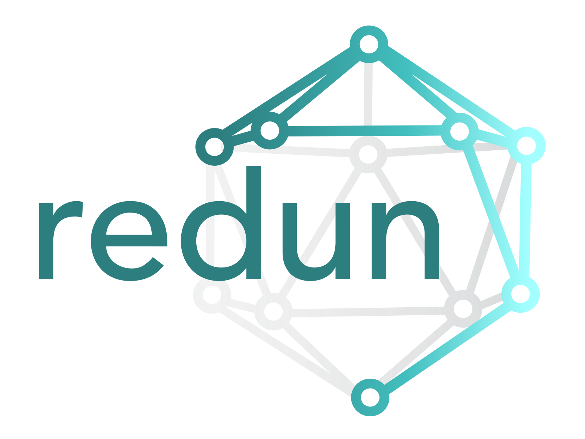

*yet another redundant workflow engine*

**redun** aims to be a more expressive and efficient workflow framework, built on top of the popular Python programming language.
It takes the somewhat contrarian view that writing dataflows directly is unnecessarily restrictive, and by doing so we lose abstractions we have come to rely on in most modern high-level languages (control flow, composability, recursion, high order functions, etc).
redun's key insight is that workflows can be expressed as lazy expressions, which are then evaluated by a scheduler that performs automatic parallelization, caching, and data provenance logging.

redun's key features are:

- Workflows are defined by lazy expressions that when evaluated emit dynamic directed acyclic graphs (DAGs), enabling complex data flows.
- Incremental computation that is reactive to both data changes as well as code changes.
- Workflow tasks can be executed on a variety of compute backend (threads, processes, AWS batch jobs, Spark jobs, etc). 
- Data changes are detected for in memory values as well as external data sources such as files and object stores using file hashing.
- Code changes are detected by hashing individual Python functions and comparing them against historical call graph recordings.
- Past intermediate results are cached centrally and reused across workflows.
- Past call graphs can be used as a data lineage record and can be queried for debugging and auditing.

See the [docs](design.md), [tutorial](https://github.com/insitro/redun/tree/main/examples), and [influences](design.md#influences) for more.

*About the name:* The name "redun" is self deprecating (there are [A LOT](https://github.com/pditommaso/awesome-pipeline) of workflow engines), but it is also a reference to its original inspiration, the [redo](https://apenwarr.ca/log/20101214) build system.

## Install

```sh
pip install redun
```

See [developing](developing.md) for more information on working with the code.

### Postgres backend

To use postgres as a recording backend, use

```sh
pip install redun[postgres]
```

The above assumes the following dependencies are installed:
* `pg_config` (in the `postgresql-devel` package; on ubuntu: `apt-get install libpq-dev`)
* `gcc` (on ubuntu or similar `sudo apt-get install gcc`)

```{toctree}
:caption: User guide
:hidden:

design
values
tasks
executors
scheduler
config
db
spark
typing
console
visualization
FAQ
```

```{toctree}
:caption: Development
:hidden:

developing
CHANGELOG
```

```{toctree}
:caption: Implementation notes
:hidden:

implementation/hashing
implementation/graph_reduction_caching
```

```{toctree}
:caption: Reference
:hidden:

API docs <redun/modules>
GitHub repository <https://github.com/insitro/redun>
```

