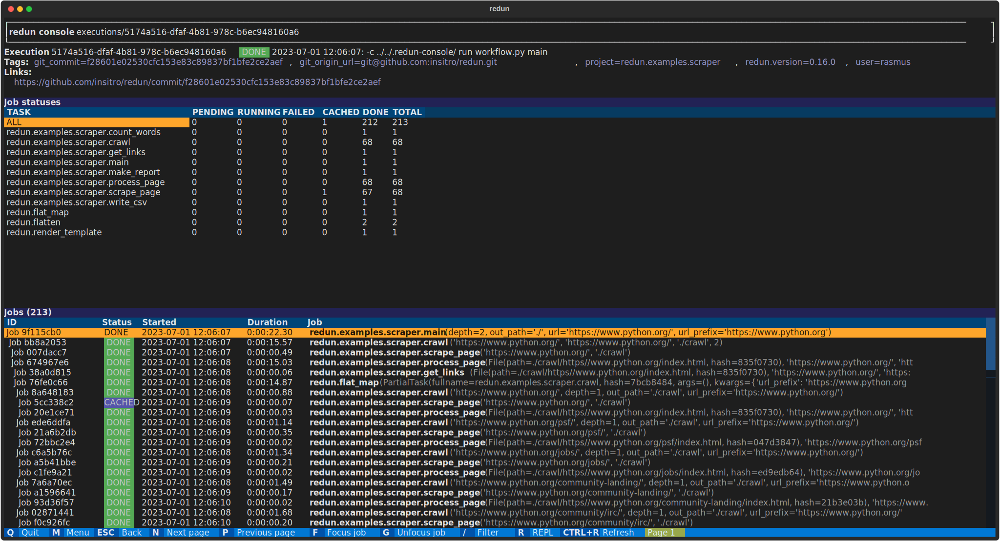

# Tags

redun provides the concept of **tags** for annotating workflow [data provenance](design.md#provenance-and-call-graphs) with additional metadata. Tags are represented as key-values pairs, where the value can be any JSON datatype (int, float, string, boolean, None, list, dict). By default, redun automatically adds tags to Executions and Jobs to record metadata such as, redun version, username, git commit, AWS Batch Job id, etc. In the example below, we have a redun Execution with tags like `redun.version=0.16.0` and `user=rasmus`. Some tags like `git_commit` can be used to automatically construct links to GitHub.



Tags are helpful for querying data provenance. For example, using the `redun log` command, we can query for all Executions run by user `rasmus`:

```sh
redun log --tag user=rasmus

Recent executions:

ion=0.16.1, user=rasmus, user_gcp=rasmus@insitro.com)
Exec 6dc981d7 [ DONE ] 2023-08-11 14:44:09:  run hello_world.py main (git_commit=b3faf931667ffd18f797334eb1feef9b464ea600, git_origin_url=git@github.com:insitro/redun.git, project=redun.examples.hello_world, redun.version=0.16.1, user=rasmus, use
r_gcp=rasmus@insitro.com)
Exec 86b72927 [ DONE ] 2023-06-15 09:27:47:  run hello_world.py main --greet Hi4 (git_commit=7ec9cb747aac9bb5bfbe6b518c9eab71296ffcc2, git_origin_url=git@github.com:insitro/redun.git, project=redun.examples.hello_world, redun.version=0.15.0, user
=rasmus)
Exec 022e2cb6 [ DONE ] 2023-06-15 09:26:12:  run hello_world.py main --greet Hi3 (git_commit=7ec9cb747aac9bb5bfbe6b518c9eab71296ffcc2, git_origin_url=git@github.com:insitro/redun.git, project=redun.examples.hello_world, redun.version=0.15.0, user
=rasmus)
Exec 525eb514 [ DONE ] 2023-06-15 09:25:49:  run hello_world.py main --greet Hi2 (git_commit=7ec9cb747aac9bb5bfbe6b518c9eab71296ffcc2, git_origin_url=git@github.com:insitro/redun.git, project=redun.examples.hello_world, redun.version=0.15.0, user
=rasmus)
```

## Tag structure

In general, users can add their own tags and attach them to any part of the recorded CallGraph (e.g. Execution, Job, Task, Value) in order to record helpful metadata and improve overall the data provenance.


In the example above, we have an illustration of the [CallGraph data structure](design.md#provenance-and-call-graphs) redun records while running a workflow. Briefly, when a user starts a new workflow execution, it is recorded with an Execution node (top right) along with a tree of Job nodes (right) for each task that is run during the workflow. For each Job, we record a CallNode (blue boxes) that connects together additional information such as the related Task, argument Values, and result Value.

As seen above, Tag nodes (green boxes) attach to a variety of node types. This allows users to record metadata specific to a particular Task, Value, Job, or Execution. Each tag has the following three properties:

- **Entity:** the id of the node the tag describes.
- **Key:** a string describing what kind of information the tag describes (e.g. `user`, `git_commit`, `aws_batch_job`)
- **Value:** a JSON datatype describing the tag value.

The key-value approach is similar to other tagging designs such as [AWS tags](https://docs.aws.amazon.com/AWSEC2/latest/UserGuide/Using_Tags.html), and the three part structure deliberately follows the [Entity, Attribute, Value](https://en.wikipedia.org/wiki/Entity%E2%80%93attribute%E2%80%93value_model) design in order to provide significant flexiblity in modeling metadata.

## Adding tags

### Adding execution tags

To add custom tags to an execution, add the `--tag` option when using `redun run`. For example, to add tags describing the kind of project and dataset being used in the workflow, we could use:

```sh
redun run --tag project=my-analysis --tag dataset=my-dataset workflow.py main
```

Tags are described in a `{key}={value}` format. For convenience, string values don't need to be quoted. Other JSON datatypes are represented as usual (but remembed to escape from shell interpretation):

```sh
redun run --tag cost=3.20 --tag final=true --tag flags '["a","b","c"]' workflow.py main
```

You may also use multiple tags of the same key. Here, we record multiple `source` tags:

```sh
redun run --tag source=my-data-source-1 --tag source=my-data-source-2 workflow.py main
```

If you are programmatically running a workflow, Execution tags can be added using the [`Scheduler.run()` method](redun.scheduler.Scheduler.run) and passing tags as a list of key-value tuples:

```py
scheduler = Scheduler(config=...)
result = scheduler.run(main(), tags=[("cost", 3.2), ("final", True)])
```

### Adding task tags

Tags can be added to Tasks using the `tags` task option in the `@task` decorator:

```py
@task(tags=[("version", "prod"), ("team", "my-team")])
def my_task(x: int, y: int) -> int:
    # ...
```

Jobs will also automatically inherit the tags of their Tasks.

### Adding value tags

To add tags to a Value, pass the value through [`apply_tags()`](redun.scheduler.apply_tags) which returns the value back unchanged, but adds the provided tags during data provenance recording. For example, consider the following code:

```py
@task
def add(a: int, b: int) -> int:
    c = a + b
    return apply_tags(c, tags=[("version", "dev")])
```

Here, the task `add()` adds two numbers as usual, but will tag the result Value `c` with the tag `version=dev`.

### Adding job tags

First, Jobs automatically inherit any tags added to their corresponding Tasks. To add additional tags at runtime, you can also add them using the [`apply_tags()`](redun.scheduler.apply_tags) task.

```py
@task
def add(a: int, b: int) -> int:
    cost = compute_cost(...)
    c = a + b
    return apply_tags(c, job_tags=[("cost", cost)])
```

Execution tags can also be added at runtime using `apply_tags(value, execution_tags=[(key, value), ...])`.

## Modifying tags after execution

Tags can also be added, removed, and updated after a workflow execution using the `redun tag` command. See `redun tag --help` for full details:

```sh
# Add a new tag `key=value` on record with id prefix `abcd1234`.
redun tag add abcd1234 key=value

# Remove the tag `key=value` from record with id prefix `abcd1234`.
redun tag rm abcd1234 key=value

# Update tag with key `key` on record with id prefix `abcd1234` with a new value `value`.
redun tag update abcd1234 key=value
```
