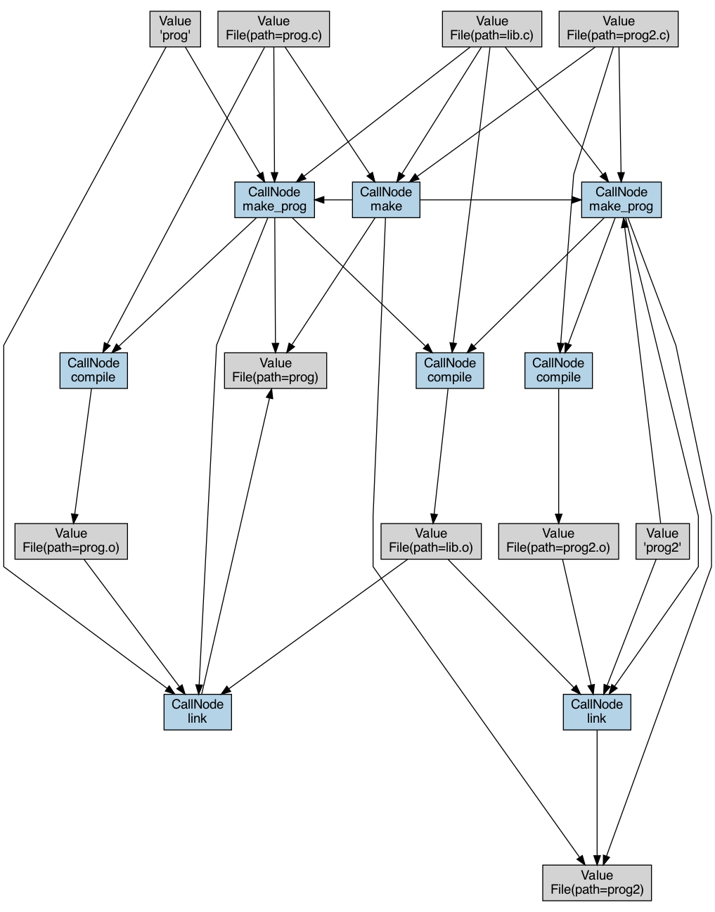

# Visualization

Visualizing the call graph of redun executions can help developers understand the evaluation and fan out/in patterns of redun programs, making them a useful debugging tool.

## Configuring visualizations

Similar to logging, we can visualize `Execution`, `Job`, `CallNode`, and `Value` objects by hash. 
The basic command to do so is `redun viz <id_or_hash_prefix>`. 
Note that `Task` objects cannot be visualized currently as they are directly associated with jobs in the context of call graphs.
If in the future we support expression graph visualization, we can include explicit task visualization that is decoupled from jobs.

`Value` queries are treated slightly differently from the other objects, with a greater focus on their upstream lineage. 
We will cover each of these two visualization scenarios separately, along with each of their relevant flags.

### Visualizing non-`Value` objects
The graphs discussed here will correspond to the example below.
```py
import os
from typing import Dict, List

from redun import task, File


@task()
def compile(c_file: File):
    """
    Compile one C file into an object file.
    """
    os.system("gcc -c {c_file}".format(c_file=c_file.path))
    return File(c_file.path.replace('.c', '.o'))


@task()
def link(prog_path: str, o_files: List[File]):
    """
    Link several object files together into one program.
    """
    os.system("gcc -o {prog_path} {o_files}".format(
        prog_path=prog_path,
        o_files=' '.join(o_file.path for o_file in o_files),
    ))
    return File(prog_path)


@task()
def make_prog(prog_path: str, c_files: List[File]):
    """
    Compile one program from its source C files.
    """
    o_files = [
        compile(c_file)
        for c_file in c_files
    ]
    prog_file = link(prog_path, o_files)
    return prog_file


# Definition of programs and their source C files.
files = {
    'prog': [
        File('prog.c'),
        File('lib.c'),
    ],
    'prog2': [
        File('prog2.c'),
        File('lib.c'),
    ],
}


@task()
def make(files : Dict[str, List[File]]=files):
    """
    Top-level task for compiling all the programs in the project.
    """
    progs = [
        make_prog(prog_path, c_files)
        for prog_path, c_files in files.items()
    ]
    return progs
```
`redun viz <exec-id>` \
The default call graph for an `Execution` omits jobs and hashes, while including complete detail.


`redun viz <exec-id> --hash` \
Adding hashes to the graph can often be useful to track values and direct further queries. 
Note that since in this call job nodes are not added, job ids are propagated down to CallNodes.


`redun viz <exec-id> --hash --jobs` \
We can also add in job nodes. When executions are rerun, and the cache is used, this is noted on the job nodes.


`redun viz <exec-id> --no-detail --jobs` \
This call produces just the job graph. 
Task names are propagated up to the job nodes in the absence of CallNodes.


`redun viz <exec-id> --deduplicate` \
Revisiting the entire execution view, we can leverage the deduplicate flag to eliminate duplicate value nodes. 
In particular, since the `make_prog` function acts as a routing call and returns the same value as `link`, that information is depicted here. 
Note that this can produce inaccurate graphs for low entropy (binary, for example) values with a high risk of hash collisions.


`redun viz <exec-id> --dataflow` \
For values that are collections of other values, we can deconstruct them to their leaf level values with this flag. 
In this example, note how the dictionary argument to `make` has now been broken down.


`redun viz <exec-id> --deduplicate --dataflow` \
Both the aforementioned flags can be used together as well. Note that these graphs tend to lose readability.



`redun viz <job-id / call-node-id>` \
We can also plot jobs or CallNodes, which both will yield a CallNode and its immediate local context.


### Visualizing `Value` objects

The graph for a value query depicts all the upstream calls and values that were required to generate the value. 
Note that the value object is taken as is and not deconstructed. 
Thus, for a nested value such as the list queried for below, only the direct lineage is revealed. 
Further details about sub-value lineage can be revealed via additional manual queries.

`redun viz <value-id>`


Let's use the same query but replace the id to query for one of the values in the list output above to capture more meaningful value lineage.
Note that this a direct visual analog of the equivalent `redun log <value-id>` query.
```
File 816366b1 prog

Upstream dataflow:

value = File(path=prog, hash=816366b1)

value <-- <eeb829f2> link(prog_path, o_files)
prog_path = <ee510692> 'prog'
o_files   = <6f33388b> [File(path=prog.o, hash=2beacc7d), File(path=lib.o, >

prog_path <-- argument of <ed5de0a2> make_prog(prog_path, c_files)
<-- origin

o_files <-- derives from
compile_result   = <bf49c011> File(path=lib.o, hash=bf49c011)
compile_result_2 = <2beacc7d> File(path=prog.o, hash=2beacc7d)

compile_result <-- <12726c10> compile(c_file)
c_file = <7769a07e> File(path=lib.c, hash=7769a07e)

c_file <-- argument of <0de606ec> make_prog(prog_path, c_files)
<-- argument of <6415bca3> make(files)
<-- origin

compile_result_2 <-- <37b5a04a> compile(c_file_2)
c_file_2 = <6884a765> File(path=prog.c, hash=6884a765)

c_file_2 <-- argument of <ed5de0a2> make_prog(prog_path, c_files)
<-- argument of <6415bca3> make(files)
<-- origin
```


Note that sub-value derivations are all included in value queries and these edges are colored a light gray.

`redun viz <value-id> --wrap-calls` \
Use this flag to condense the routing CallNodes. 
This flag makes routing calls more informative because it displays not only the fact that the given value is passed to some set of CallNodes, but also how these CallNodes themselves are nested relative to each other in the hierarchy of calls. 


### Final Notes
The image generated may vary between calls. If the graph generated is difficult to read, utilize the flags to remove job nodes, shift to a horizontal layout, or simply try rerunning again.

For convenience, the flags are broken down by when they are appropriate to use.
