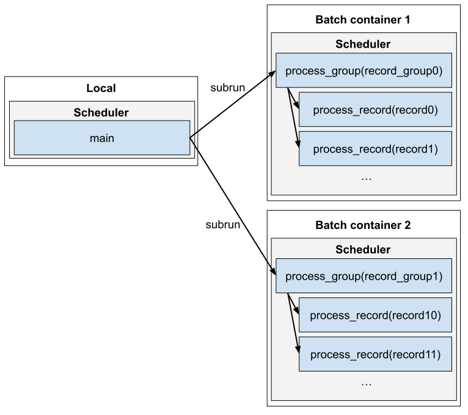

# subrun example

This is an advanced example of how to distribute redun jobs across both Batch containers and processes *within* those containers. For example, a user may want to do this in order to make use of multiple processes per Batch job. Although, one could always use another mechanism for process parallelism like [multiprocessing](https://docs.python.org/3/library/multiprocessing.html), they would lose the benefits of redun such as caching and provenance.

redun supports this kind of job dispatch using a special scheduler task called `subrun`. Briefly, `subrun(expr, executor=executor_name)` will launch a job on Executor `executor_name` and within it start a new Scheduler to evaluate the expression `expr`. The results of the "subscheduler" are returned by `subrun()`. See module documentation for details.

In this example ([workflow.py](workflow.py)), the task `main` will launch 2 jobs of task `process_group` that each run in AWS Batch containers. Within those containers, we will launch 10 `process_record` jobs each in their own process.

<p align="center">
  
</p>


## Setup

Since this example uses AWS Batch we review again how to prepare a Docker image. These instructions are the same as previous examples.

When running full redun tasks on AWS Batch (as opposed to just a shell command), we need to install redun in our Docker image. To avoid [credential complexities](http://blog.oddbit.com/post/2019-02-24-docker-build-learns-about-secr/) when installing from private github repos, in this example, we will just copy redun into the container. Use the following make command to do so:

```sh
cd docker/
make setup
```

Now, we can use the following make command to build our Docker image. To specify a specific registry and image name, please edit the variables in [Makefile](docker/Makefile).

```sh
make login
make build
```

After the image builds, we need to publish it to ECR so that it is accessible by AWS Batch. There are several steps for doing that, which are covered in these make commands:

```sh
# If the docker repo does not exist yet.
make create-repo

# Push the locally built image to ECR.
make push
```

## Running the example:

You can run the example with the command:

```sh
redun run workflow.py main
```

You should see output something like:

```
{'name': 'main',
 'results': [{'name': 'root_on_batch',
              'pid': 1,
              'uname': b'Linux ip-172-31-151-65.us-west-2.compute.internal 4.'
                       b'14.232-176.381.amzn2.x86_64 #1 SMP Wed May 19 00:31:'
                       b'54 UTC 2021 x86_64 x86_64 x86_64 GNU/Linux\n',
              'value': [{'name': 'process_record',
                         'pid': 13,
                         'uname': b'Linux ip-172-31-151-65.us-west-2.compute'
                                  b'.internal 4.14.232-176.381.amzn2.x86_64 '
                                  b'#1 SMP Wed May 19 00:31:54 UTC 2021 x86_'
                                  b'64 x86_64 x86_64 GNU/Linux\n',
                         'value': 2},
                        {'name': 'process_record',
                         'pid': 33,
                         'uname': b'Linux ip-172-31-151-65.us-west-2.compute'
                                  b'.internal 4.14.232-176.381.amzn2.x86_64 '
                                  b'#1 SMP Wed May 19 00:31:54 UTC 2021 x86_'
                                  b'64 x86_64 x86_64 GNU/Linux\n',
                         'value': 3},
                        {'name': 'process_record',
                         'pid': 26,
                         'uname': b'Linux ip-172-31-151-65.us-west-2.compute'
                                  b'.internal 4.14.232-176.381.amzn2.x86_64 '
                                  b'#1 SMP Wed May 19 00:31:54 UTC 2021 x86_'
                                  b'64 x86_64 x86_64 GNU/Linux\n',
                         'value': 4},
                        {'name': 'process_record',
                         'pid': 22,
                         'uname': b'Linux ip-172-31-151-65.us-west-2.compute'
                                  b'.internal 4.14.232-176.381.amzn2.x86_64 '
                                  b'#1 SMP Wed May 19 00:31:54 UTC 2021 x86_'
                                  b'64 x86_64 x86_64 GNU/Linux\n',
                         'value': 5},
                        {'name': 'process_record',
                         'pid': 16,
                         'uname': b'Linux ip-172-31-151-65.us-west-2.compute'
                                  b'.internal 4.14.232-176.381.amzn2.x86_64 '
                                  b'#1 SMP Wed May 19 00:31:54 UTC 2021 x86_'
                                  b'64 x86_64 x86_64 GNU/Linux\n',
                         'value': 6},
                        {'name': 'process_record',
                         'pid': 24,
                         'uname': b'Linux ip-172-31-151-65.us-west-2.compute'
                                  b'.internal 4.14.232-176.381.amzn2.x86_64 '
                                  b'#1 SMP Wed May 19 00:31:54 UTC 2021 x86_'
                                  b'64 x86_64 x86_64 GNU/Linux\n',
                         'value': 7},
                        {'name': 'process_record',
                         'pid': 28,
                         'uname': b'Linux ip-172-31-151-65.us-west-2.compute'
                                  b'.internal 4.14.232-176.381.amzn2.x86_64 '
                                  b'#1 SMP Wed May 19 00:31:54 UTC 2021 x86_'
                                  b'64 x86_64 x86_64 GNU/Linux\n',
                         'value': 8},
                        {'name': 'process_record',
                         'pid': 18,
                         'uname': b'Linux ip-172-31-151-65.us-west-2.compute'
                                  b'.internal 4.14.232-176.381.amzn2.x86_64 '
                                  b'#1 SMP Wed May 19 00:31:54 UTC 2021 x86_'
                                  b'64 x86_64 x86_64 GNU/Linux\n',
                         'value': 9},
                        {'name': 'process_record',
                         'pid': 15,
                         'uname': b'Linux ip-172-31-151-65.us-west-2.compute'
                                  b'.internal 4.14.232-176.381.amzn2.x86_64 '
                                  b'#1 SMP Wed May 19 00:31:54 UTC 2021 x86_'
                                  b'64 x86_64 x86_64 GNU/Linux\n',
                         'value': 10},
                        {'name': 'process_record',
                         'pid': 21,
                         'uname': b'Linux ip-172-31-151-65.us-west-2.compute'
                                  b'.internal 4.14.232-176.381.amzn2.x86_64 '
                                  b'#1 SMP Wed May 19 00:31:54 UTC 2021 x86_'
                                  b'64 x86_64 x86_64 GNU/Linux\n',
                         'value': 11}]},
             {'name': 'root_on_batch',
              'pid': 1,
              'uname': b'Linux ip-172-31-151-65.us-west-2.compute.internal 4.'
                       b'14.232-176.381.amzn2.x86_64 #1 SMP Wed May 19 00:31:'
                       b'54 UTC 2021 x86_64 x86_64 x86_64 GNU/Linux\n',
              'value': [{'name': 'process_record',
                         'pid': 25,
                         'uname': b'Linux ip-172-31-151-65.us-west-2.compute'
                                  b'.internal 4.14.232-176.381.amzn2.x86_64 '
                                  b'#1 SMP Wed May 19 00:31:54 UTC 2021 x86_'
                                  b'64 x86_64 x86_64 GNU/Linux\n',
                         'value': 12},
                        {'name': 'process_record',
                         'pid': 26,
                         'uname': b'Linux ip-172-31-151-65.us-west-2.compute'
                                  b'.internal 4.14.232-176.381.amzn2.x86_64 '
                                  b'#1 SMP Wed May 19 00:31:54 UTC 2021 x86_'
                                  b'64 x86_64 x86_64 GNU/Linux\n',
                         'value': 13},
                        {'name': 'process_record',
                         'pid': 18,
                         'uname': b'Linux ip-172-31-151-65.us-west-2.compute'
                                  b'.internal 4.14.232-176.381.amzn2.x86_64 '
                                  b'#1 SMP Wed May 19 00:31:54 UTC 2021 x86_'
                                  b'64 x86_64 x86_64 GNU/Linux\n',
                         'value': 14},
                        {'name': 'process_record',
                         'pid': 32,
                         'uname': b'Linux ip-172-31-151-65.us-west-2.compute'
                                  b'.internal 4.14.232-176.381.amzn2.x86_64 '
                                  b'#1 SMP Wed May 19 00:31:54 UTC 2021 x86_'
                                  b'64 x86_64 x86_64 GNU/Linux\n',
                         'value': 15},
                        {'name': 'process_record',
                         'pid': 28,
                         'uname': b'Linux ip-172-31-151-65.us-west-2.compute'
                                  b'.internal 4.14.232-176.381.amzn2.x86_64 '
                                  b'#1 SMP Wed May 19 00:31:54 UTC 2021 x86_'
                                  b'64 x86_64 x86_64 GNU/Linux\n',
                         'value': 16},
                        {'name': 'process_record',
                         'pid': 30,
                         'uname': b'Linux ip-172-31-151-65.us-west-2.compute'
                                  b'.internal 4.14.232-176.381.amzn2.x86_64 '
                                  b'#1 SMP Wed May 19 00:31:54 UTC 2021 x86_'
                                  b'64 x86_64 x86_64 GNU/Linux\n',
                         'value': 17},
                        {'name': 'process_record',
                         'pid': 27,
                         'uname': b'Linux ip-172-31-151-65.us-west-2.compute'
                                  b'.internal 4.14.232-176.381.amzn2.x86_64 '
                                  b'#1 SMP Wed May 19 00:31:54 UTC 2021 x86_'
                                  b'64 x86_64 x86_64 GNU/Linux\n',
                         'value': 18},
                        {'name': 'process_record',
                         'pid': 31,
                         'uname': b'Linux ip-172-31-151-65.us-west-2.compute'
                                  b'.internal 4.14.232-176.381.amzn2.x86_64 '
                                  b'#1 SMP Wed May 19 00:31:54 UTC 2021 x86_'
                                  b'64 x86_64 x86_64 GNU/Linux\n',
                         'value': 19},
                        {'name': 'process_record',
                         'pid': 20,
                         'uname': b'Linux ip-172-31-151-65.us-west-2.compute'
                                  b'.internal 4.14.232-176.381.amzn2.x86_64 '
                                  b'#1 SMP Wed May 19 00:31:54 UTC 2021 x86_'
                                  b'64 x86_64 x86_64 GNU/Linux\n',
                         'value': 20},
                        {'name': 'process_record',
                         'pid': 21,
                         'uname': b'Linux ip-172-31-151-65.us-west-2.compute'
                                  b'.internal 4.14.232-176.381.amzn2.x86_64 '
                                  b'#1 SMP Wed May 19 00:31:54 UTC 2021 x86_'
                                  b'64 x86_64 x86_64 GNU/Linux\n',
                         'value': 21}]}],
 'uname': b'Darwin MBP-HMD6RF868B 20.6.0 Darwin Kernel Version 20.6.0: Wed N'
          b'ov 10 22:23:07 PST 2021; root:xnu-7195.141.14~1/RELEASE_X86_64 x'
          b'86_64\n'}
```

Notice, how the `uname` illustrates which kind of machine each job runs on and the `pid` (process id) indicates that we are distributing across processes for `process_record`.
